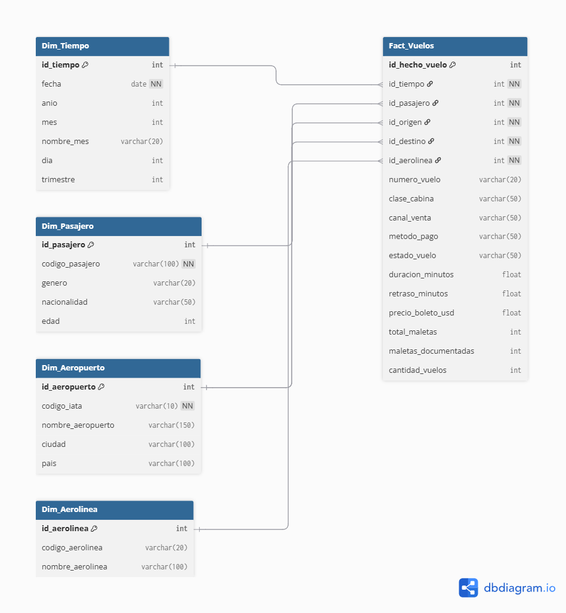

# Documentación técnica completa - Práctica 1 (ETL Vuelos)

## 1) Objetivo

Implementar un proceso ETL que toma datos crudos de vuelos (`dataset_vuelos_crudo.csv`), los limpia y transforma con Python, y los carga a un modelo dimensional (esquema estrella) en SQL Server para análisis de indicadores operativos.

---

## 2) Alcance y entregables

- Extracción desde archivo CSV local.
- Transformación de calidad básica y normalización de formatos.
- Carga de dimensiones:
  - `Dim_Tiempo`
  - `Dim_Pasajero`
  - `Dim_Aeropuerto`
  - `Dim_Aerolinea`
- Construcción y carga de `Fact_Vuelos` con llaves foráneas.
- Consultas analíticas en `db/querys.sql`.
- Script de creación de base y tablas en `db/createDB.sql`.

---

## 3) Arquitectura del proceso

**Fuente**
- Archivo plano CSV: `dataset_vuelos_crudo.csv`

**Procesamiento (ETL)**
- Script Python: `etl1.py`
- Librerías: `pandas`, `numpy`, `sqlalchemy`, `pyodbc`

**Destino**
- SQL Server (`localhost\SQLEXPRESS`)
- Base de datos: `Vuelos_Practica1`

**Modelo analítico**
- Esquema estrella con una tabla de hechos (`Fact_Vuelos`) y cuatro dimensiones.

---

## 4) Modelo de datos (ER)

El modelo relacional utilizado está representado en la siguiente imagen:



Relaciones principales:
- `Fact_Vuelos.id_tiempo -> Dim_Tiempo.id_tiempo`
- `Fact_Vuelos.id_pasajero -> Dim_Pasajero.id_pasajero`
- `Fact_Vuelos.id_origen -> Dim_Aeropuerto.id_aeropuerto`
- `Fact_Vuelos.id_destino -> Dim_Aeropuerto.id_aeropuerto`
- `Fact_Vuelos.id_aerolinea -> Dim_Aerolinea.id_aerolinea`

---

## 5) Diccionario técnico de datos

### 5.1 Fuente (`dataset_vuelos_crudo.csv`)

Columnas relevantes detectadas:
- `record_id`
- `airline_code`, `airline_name`
- `flight_number`
- `origin_airport`, `destination_airport`
- `departure_datetime`, `arrival_datetime`
- `duration_min`, `status`, `delay_min`
- `aircraft_type`, `cabin_class`, `seat`
- `passenger_id`, `passenger_gender`, `passenger_age`, `passenger_nationality`
- `booking_datetime`, `sales_channel`, `payment_method`
- `ticket_price`, `currency`, `ticket_price_usd_est`
- `bags_total`, `bags_checked`

### 5.2 Destino (modelo dimensional)

**Dim_Tiempo**
- `id_tiempo` (PK, identity)
- `fecha`, `anio`, `mes`, `nombre_mes`, `dia`, `trimestre`

**Dim_Pasajero**
- `id_pasajero` (PK, identity)
- `codigo_pasajero`, `genero`, `nacionalidad`, `edad`

**Dim_Aeropuerto**
- `id_aeropuerto` (PK, identity)
- `codigo_iata`, `nombre_aeropuerto`, `ciudad`, `pais`

**Dim_Aerolinea**
- `id_aerolinea` (PK, identity)
- `codigo_aerolinea`, `nombre_aerolinea`

**Fact_Vuelos**
- Claves: `id_hecho_vuelo` (PK), FK a todas las dimensiones
- Atributos de contexto: `numero_vuelo`, `clase_cabina`, `canal_venta`, `metodo_pago`, `estado_vuelo`
- Métricas: `duracion_minutos`, `retraso_minutos`, `precio_boleto_usd`, `total_maletas`, `maletas_documentadas`, `cantidad_vuelos`

---

## 6) Proceso ETL detallado (`etl1.py`)

### Etapa 0: Conexión
- Se construye conexión ODBC a SQL Server con `Trusted_Connection=yes` y `TrustServerCertificate=yes`.
- Se valida conectividad con `SELECT 1`.

### Etapa 1: Extracción
- Lectura del archivo: `pd.read_csv('dataset_vuelos_crudo.csv')`.

### Etapa 2: Transformación
1. **Filtrado de nulos críticos**
	- Se eliminan filas con nulos en:
	- `passenger_id`, `departure_datetime`, `origin_airport`, `destination_airport`

2. **Normalización de texto**
	- Para columnas categóricas (`airline_code`, `origin_airport`, `destination_airport`, `status`, `cabin_class`, `sales_channel`, `payment_method`):
	- `strip()` + `upper()`

3. **Manejo de fechas**
	- Conversión de `departure_datetime` con `pd.to_datetime(..., format='mixed', dayfirst=True)`
	- Derivación de `fecha_dt` (solo fecha) para llave temporal

### Etapa 3: Carga de dimensiones
- `Dim_Aerolinea`: pares únicos de código/nombre de aerolínea
- `Dim_Pasajero`: atributos demográficos por pasajero
- `Dim_Aeropuerto`: unión de origen y destino para catálogo IATA
- `Dim_Tiempo`: fecha y atributos calendarios derivados

Todas las cargas se realizan con `to_sql(..., if_exists='append', index=False)`.

### Etapa 4: Construcción de hechos
1. Se leen dimensiones desde SQL para obtener IDs sustitutos.
2. Se ejecutan `merge` sucesivos para resolver llaves foráneas:
	- Aerolínea, pasajero, tiempo, aeropuerto origen, aeropuerto destino
3. Se seleccionan y renombran columnas de negocio hacia estructura de `Fact_Vuelos`.
4. Se agrega medida aditiva `cantidad_vuelos = 1`.
5. Se carga `Fact_Vuelos` con `append`.

---

## 7) Creación de base y tablas (`db/createDB.sql`)

El script realiza:
- `CREATE DATABASE Vuelos_Practica1`
- Creación de dimensiones y tabla de hechos
- Definición de llaves primarias y foráneas
- Estandarización posterior de género en `Dim_Pasajero`:
  - `M|MASCULINO -> Masculino`
  - `F|FEMENINO -> Femenino`

---

## 8) Consultas analíticas (`db/querys.sql`)

Incluye consultas para:
- Validación de volumen por tabla (conteo por dimensión + hecho)
- KPIs globales:
  - total de vuelos
  - total de maletas documentadas
  - ingresos totales USD
  - retraso promedio
- Top 5 destinos más frecuentes
- Top 5 aerolíneas más utilizadas
- Distribución de vuelos por aerolínea

---

## 9) Requisitos técnicos

### Software
- Python 3.10+
- SQL Server (Express o superior)
- Driver ODBC 17 para SQL Server

### Paquetes Python
- `pandas`
- `numpy`
- `sqlalchemy`
- `pyodbc`

Instalación sugerida:

```bash
pip install pandas numpy sqlalchemy pyodbc
```

---

## 10) Ejecución del proceso

1. Ejecutar `db/createDB.sql` en SQL Server.
2. Verificar que el nombre de instancia y base coincide en `etl1.py`:
	- `server_name = localhost\SQLEXPRESS`
	- `db_name = Vuelos_Practica1`
3. Ejecutar ETL:

```bash
python etl1.py
```

4. Ejecutar `db/querys.sql` para validar resultados de carga y análisis.

---

## 11) Validación y control de calidad

Validaciones implementadas actualmente:
- Conectividad a BD al inicio del proceso.
- Eliminación de registros incompletos en campos críticos.
- Homogeneización de variables categóricas.
- Verificación de resultados mediante consultas agregadas.

Validaciones recomendadas para una versión robusta:
- Control de duplicados en dimensiones (constraints únicos).
- Carga incremental con marca de ejecución (evitar recargas completas con `append`).
- Reglas de calidad para fechas inconsistentes y estados cancelados.
- Bitácora ETL (fecha, volumen leído, volumen insertado, errores).

---


## 12) Resultado final

La práctica implementa un flujo ETL funcional y reproducible para análisis de vuelos en un esquema estrella, habilitando consultas de rendimiento operacional y de negocio sobre `Fact_Vuelos` y sus dimensiones.

