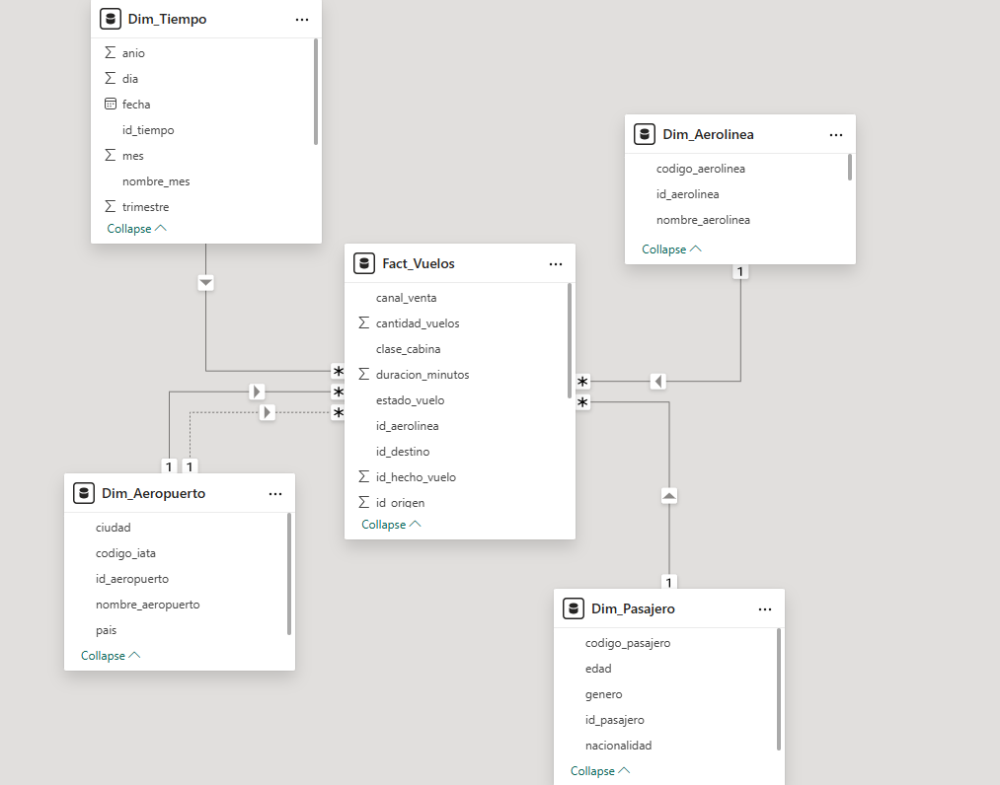
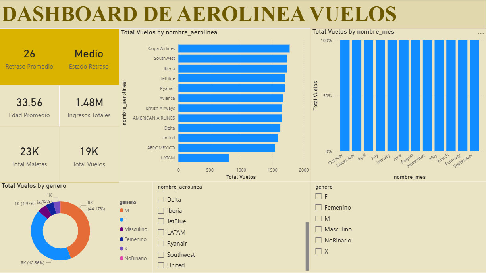
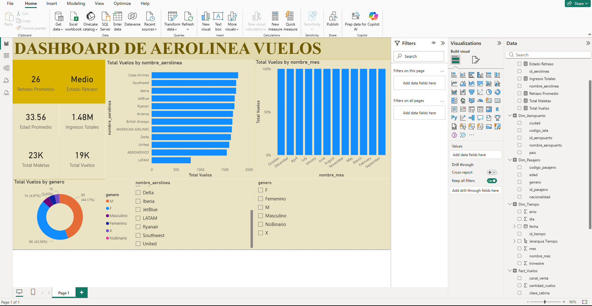
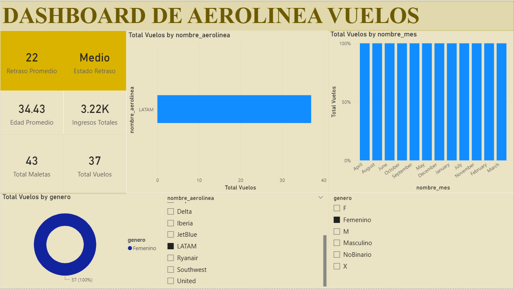

# Práctica 2 - Dashboard Analítico de Vuelos

## 1. Descripción General

La presente práctica corresponde a la implementación de un modelo analítico utilizando Power BI como continuación de la Práctica 1, en la cual se desarrolló un proceso ETL para la carga de datos de vuelos en SQL Server.

El objetivo principal es transformar los datos estructurados en información útil mediante la construcción de un dashboard interactivo que permita el análisis de indicadores clave de desempeño (KPIs) relacionados con operaciones aéreas, pasajeros y comportamiento de vuelos.

---

## 2. Origen de los Datos

Los datos utilizados provienen de un dataset de vuelos previamente procesado mediante un proceso ETL en Python.

Estos datos fueron cargados en SQL Server bajo un modelo dimensional tipo estrella, compuesto por:

- Fact_Vuelos
- Dim_Aerolinea
- Dim_Aeropuerto
- Dim_Pasajero
- Dim_Tiempo

La conexión a la base de datos se realizó mediante:

Servidor:
localhost\SQLEXPRESS

Base de datos:
Vuelos_Practica1

---

## 3. Modelo de Datos

El modelo implementado sigue una estructura dimensional, donde:

- Fact_Vuelos contiene las métricas principales (cantidad de vuelos, ingresos, retrasos, etc.)
- Las tablas dimensión contienen atributos descriptivos para análisis

Relaciones principales:

- Dim_Aerolinea → Fact_Vuelos
- Dim_Pasajero → Fact_Vuelos
- Dim_Tiempo → Fact_Vuelos
- Dim_Aeropuerto → Fact_Vuelos (origen y destino)

Se implementó además una jerarquía temporal en Dim_Tiempo:

- Año
- Mes
- Día

### Vista del modelo de datos

---

## 4. Transformaciones Realizadas

Durante la carga en Power BI se realizaron transformaciones básicas:

- Validación de tipos de datos
- Limpieza de valores nulos
- Verificación de relaciones entre tablas
- Ajuste de campos para análisis (fechas, valores numéricos, categorías)

Estas transformaciones permiten garantizar consistencia en el análisis.

---

## 5. Medidas DAX Implementadas

Se definieron las siguientes medidas:

Total Vuelos:
SUM(Fact_Vuelos[cantidad_vuelos])

Ingresos Totales:
SUM(Fact_Vuelos[precio_boleto_usd])

Retraso Promedio:
AVERAGE(Fact_Vuelos[retraso_minutos])

Edad Promedio:
AVERAGE(Dim_Pasajero[edad])

Total Maletas:
SUM(Fact_Vuelos[total_maletas])

---

## 6. KPI con Indicador Visual

Se implementó un KPI basado en el retraso promedio, acompañado de un indicador tipo semáforo:

- Bajo: retraso menor o igual a 10 minutos
- Medio: entre 10 y 30 minutos
- Alto: mayor a 30 minutos

Esto permite evaluar rápidamente el desempeño operativo.

---

## 7. Dashboard Construido

El dashboard incluye:

### KPIs principales:
- Total de vuelos
- Ingresos totales
- Retraso promedio
- Edad promedio
- Total de maletas

### Visualizaciones:

- Gráfico de barras:
  Vuelos por aerolínea (comparativo principal)

- Gráfico de dona:
  Distribución de vuelos por género

- Gráfico de columnas:
  Vuelos por mes

### Segmentadores:

- Aerolínea
- Género

Esto permite análisis interactivo del comportamiento de los datos.

---

## 8. Capturas del Dashboard

### Vista general del dashboard

---

### Vista del dashboard en Power BI

---

### KPI con semáforo de retraso

---

### Segmentadores funcionando

---

## 9. Interpretación de KPIs

- El total de vuelos permite medir el volumen general de operaciones.
- Los ingresos totales reflejan el impacto económico del sistema.
- El retraso promedio es un indicador crítico del desempeño operativo.
- La edad promedio permite analizar el perfil demográfico de los pasajeros.
- La distribución por género muestra la composición de la demanda.
- El análisis por aerolínea permite identificar participación relativa en el mercado.

El indicador de retraso en estado "Alto" sugiere posibles ineficiencias operativas que deben ser analizadas.

---

## 10. Informe Ejecutivo

El análisis desarrollado mediante Power BI permite obtener una visión clara del comportamiento del sistema de vuelos.

Se identifican patrones importantes en términos de distribución de pasajeros, desempeño de aerolíneas y eficiencia operativa. El KPI de retraso indica que existe un nivel elevado de demoras, lo cual puede impactar negativamente la experiencia del usuario.

Asimismo, los ingresos totales reflejan una actividad económica significativa, lo que demuestra la importancia del sector analizado.

El dashboard permite a los tomadores de decisiones explorar los datos de manera interactiva, facilitando la identificación de tendencias y áreas de mejora.

---

## 11. Conclusiones

- El uso de modelos dimensionales facilita el análisis de datos complejos.
- Power BI permite transformar datos en información visual comprensible.
- Los KPIs son fundamentales para la toma de decisiones.
- La integración de ETL + SQL Server + Power BI constituye una arquitectura sólida de Business Intelligence.
- La interactividad del dashboard permite explorar diferentes escenarios de análisis.

---

## 12. Estructura del Proyecto

Practica2/
│
├── dashboard.pbix
├── README.md
└── images/
    ├── Dashboard_VistaGeneral.png
    ├── Dashboard_VistaPowerBi.png
  ├── ModeloDatos.png
    ├── Semafoto_Funcionando.png
    └── Slicer_Funcionando.png