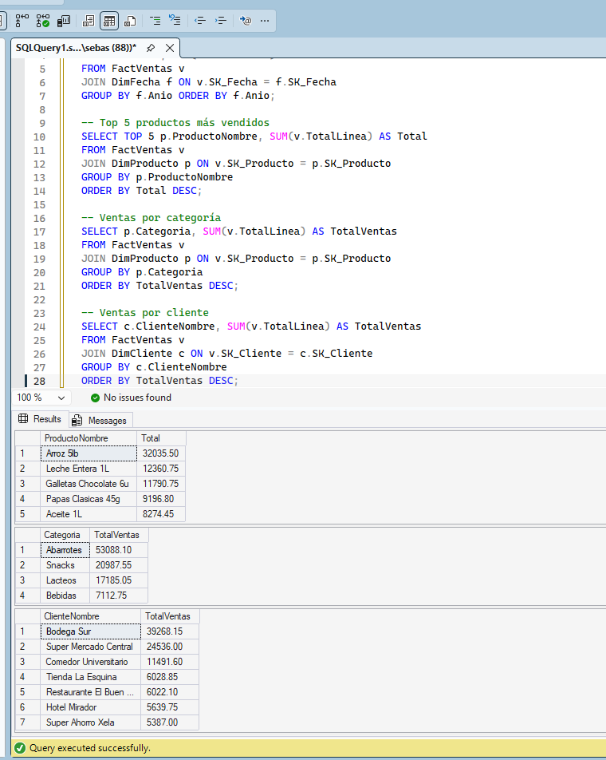
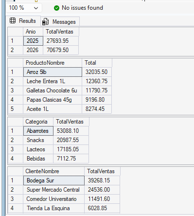

# Proyecto 1 — Solución de Business Intelligence para SG-Food

<div align="center">


**Universidad San Carlos de Guatemala**  
**Facultad de Ingeniería — Escuela de Ciencias y Sistemas**  
**Seminario de Sistemas 2 — Semestre 2026-1**

| Campo | Detalle |
|---|---|
| Estudiante | Sebastian Sandoval |
| Carné | 202010298 |
| Sección | SS21S2026 |
| Proyecto | Proyecto 1 — Flujo Microsoft BI (SSIS + SSAS) |
| Empresa | SG-Food (ficticia) |
| Fecha | Abril 2026 |

</div>

---

## Tabla de Contenidos

1. [Resumen Ejecutivo](#-resumen-ejecutivo)
2. [Arquitectura del Sistema](#-arquitectura-del-sistema)
3. [Descripción del Problema](#-descripción-del-problema)
4. [Fuente de Datos](#-fuente-de-datos)
5. [Fase 1: Diseño del Data Warehouse](#-fase-1-diseño-del-data-warehouse)
6. [Fase 2: Proceso ETL con SSIS](#-fase-2-proceso-etl-con-ssis)
7. [Fase 3: Modelo Analítico SSAS](#-fase-3-modelo-analítico-ssas)
8. [Resultados de Validación](#-resultados-de-validación)
9. [Manual de Implementación](#-manual-de-implementación)
10. [Estructura del Repositorio](#-estructura-del-repositorio)
11. [Justificación del Diseño](#-justificación-del-diseño)
12. [Conclusiones](#-conclusiones)
13. [Nota Técnica — Compatibilidad SSAS](#-nota-técnica--compatibilidad-ssas)

---

## Resumen Ejecutivo

Este proyecto implementa una solución completa de **Business Intelligence (BI)** bajo el ecosistema de herramientas Microsoft, cubriendo el flujo de extremo a extremo que va desde una base de datos transaccional hasta un cubo OLAP multidimensional listo para análisis.

La empresa ficticia **SG-Food**, dedicada a la distribución y comercialización de productos de consumo masivo en Guatemala, contaba con un sistema operacional (OLTP) funcional pero incapaz de soportar análisis estratégico de manera eficiente. Este proyecto resuelve esa brecha implementando:

- **Un Data Warehouse (DW_SGFood)** en SQL Server con esquema estrella, optimizado para consultas analíticas.
- **Un proceso ETL completo (ETL_SGFood)** desarrollado en SQL Server Integration Services (SSIS), que extrae los datos transaccionales, los transforma y los carga en el DW.
- **Un modelo OLAP multidimensional (SSAS_SGFood)** desarrollado en SQL Server Analysis Services (SSAS), con un cubo que centraliza métricas de ventas e inventario, organizado en dimensiones y jerarquías para análisis flexible.

Los resultados muestran que la solución carga correctamente **1,000 registros de ventas** distribuidos en **12 productos**, **7 clientes** y **2,557 fechas** (rango 2020–2026), con métricas de ventas e inventario disponibles para exploración multidimensional.

---

## Arquitectura del Sistema

```

                    ARQUITECTURA BI — SG-FOOD                            


  
     FUENTE DE DATOS   
    34.63.26.98,1433   
                       
    SGFoodOLTP (OLTP)  
    dbo.Transacciones  
    Venta              
    1,000 registros    
  
             ADO.NET
             SQL Auth
           
  
                SSIS — ETL_SGFood                      
                                                       
    00_Master.dtsx                                     
                                                      
         01_Load_DimProducto.dtsx                   
               Source → Destination                   
                                                      
         02_Load_DimCliente.dtsx                    
               Source → Destination                   
                                                      
         03_Load_FactVentas.dtsx                    
               Source → DataConv → Lookup×2 → Dest    
                                                      
         04_Load_FactInventario.dtsx                
                Source → DataConv → Lookup×2 → Dest    
  
                           ADO.NET
                           Windows Auth
                         
  
           DATA WAREHOUSE — DW_SGFood                  
           localhost\SQLEXPRESS                        
                                                       
     DimFecha        DimProducto      DimCliente        
     (2,557 reg)     (12 reg)         (7 reg)           
                                                     
                       
                                                       
                FactVentas (1,000 reg)                  
                FactInventario (1,000 reg)              
  
                           DSV
                           OLE DB
                         
  
         SSAS — SSAS_SGFood (Multidimensional)         
                                                       
     Cubo: DW SG Food                                  
                                                       
     MG: Fact Ventas        MG: Fact Inventario        
     - Cantidad Vendida     - Exist. Antes Venta       
     - Total Linea          - Exist. Despues Venta     
     - Precio Unitario      - Cantidad Vendida         
     - Costo Unitario                                  
     - Descuento Aplicado                              
                                                       
     DIM Fecha    DIM Producto    DIM Cliente           
  
```

---

## Descripción del Problema

### Contexto Empresarial

**SG-Food** es una empresa guatemalteca dedicada a la distribución y comercialización de productos de consumo masivo (abarrotes, snacks, lácteos, bebidas) hacia clientes institucionales como supermercados, comedores universitarios y tiendas de barrio en distintos departamentos del país.

### Problemas Identificados

| Problema | Impacto |
|---|---|
| **Tiempos de respuesta lentos** | Los gerentes no podían obtener reportes en tiempo útil; las consultas analíticas degradaban el sistema transaccional. |
| **Sobrecarga en SGFoodOLTP** | Las consultas de análisis competían con las operaciones de ventas, poniendo en riesgo la disponibilidad del sistema principal. |
| **Reportes rígidos** | Los reportes existentes eran estáticos y no permitían hacer drill-down ni cruzar dimensiones libremente. |
| **Sin separación analítica** | No existía una capa analítica separada; toda la lógica de negocio vivía en la base transaccional. |

### Solución Implementada

Se adoptó la arquitectura clásica del **flujo Microsoft BI**:

1. **Separar la carga analítica** de la base transaccional mediante un Data Warehouse dedicado.
2. **Automatizar la carga de datos** a través de paquetes SSIS que transforman y consolidan la información.
3. **Habilitar análisis multidimensional** mediante un cubo SSAS con jerarquías predefinidas que permiten navegar los datos desde distintos ángulos.

---

## Fuente de Datos

### Conexión al Sistema Transaccional

| Parámetro | Valor |
|---|---|
| Servidor | `34.63.26.98,1433` |
| Base de Datos | `SGFoodOLTP` |
| Autenticación | SQL Server Authentication |
| Tabla Principal | `dbo.TransaccionesVenta` |
| Total de Registros | 1,000 |

### Estructura de la Tabla Fuente

```sql
-- dbo.TransaccionesVenta — Estructura completa
SELECT
    TransaccionId,          -- INT, identificador único de transacción
    FechaTransaccion,       -- DATETIME, fecha y hora de la venta
    ClienteId,              -- VARCHAR, código del cliente
    ClienteNombre,          -- VARCHAR, nombre del cliente
    SegmentoCliente,        -- VARCHAR, segmento (Institucional, Retail, etc.)
    CanalVenta,             -- VARCHAR, canal de distribución
    Departamento,           -- VARCHAR, departamento de Guatemala
    Municipio,              -- VARCHAR, municipio específico
    ProductoSKU,            -- VARCHAR, código del producto
    ProductoNombre,         -- VARCHAR, nombre descriptivo del producto
    Marca,                  -- VARCHAR, marca del producto
    Categoria,              -- VARCHAR, categoría (Abarrotes, Snacks, etc.)
    Subcategoria,           -- VARCHAR, subcategoría específica
    Fabricante,             -- VARCHAR, empresa fabricante
    CantidadVendida,        -- INT, unidades vendidas en la transacción
    ExistenciaAntesVenta,   -- INT, stock antes de la venta
    ExistenciaDespuesVenta, -- INT, stock después de la venta
    PrecioUnitario,         -- DECIMAL, precio de venta por unidad
    CostoUnitario,          -- DECIMAL, costo de adquisición por unidad
    DescuentoAplicado,      -- DECIMAL, descuento en valor monetario
    TotalLinea,             -- DECIMAL, valor total de la línea de venta
    FechaRegistroUtc        -- DATETIME, timestamp UTC del registro
FROM dbo.TransaccionesVenta;
```

### Características de los Datos

- **Período cubierto:** 2025–2026
- **Clientes únicos:** 7 (Bodega Sur, Super Mercado Central, Comedor Universitario, Tienda La Esquina, entre otros)
- **Productos únicos:** 12 (Arroz 5lb, Leche Entera 1L, Galletas Chocolate 6u, Papas Clásicas 45g, Aceite 1L, entre otros)
- **Categorías:** Abarrotes, Snacks, Lácteos, Bebidas
- **Cobertura geográfica:** Múltiples departamentos y municipios de Guatemala

---

## Fase 1: Diseño del Data Warehouse

### Modelo de Datos — Esquema Estrella

```
                           
                                     DimFecha              
                           
                            PK  SK_Fecha (INT, YYYYMMDD)  
                                Fecha (DATE)               
                                Dia (INT)                  
                                NombreDia (VARCHAR)        
                                Mes (INT)                  
                                NombreMes (VARCHAR)        
                                Trimestre (INT)            
                                Semestre (INT)             
                                Anio (INT)                 
                                [2,557 registros]          
                           
                                           FK: SK_Fecha
                                          
      
       DimProducto                    FactVentas                      DimCliente         
      
 PK  SK_Producto (INT)        PK  SK_Venta (INT)             PK  SK_Cliente (INT)     
     ProductoSKU               FK  SK_Fecha                       ClienteId             
     ProductoNombre         FK  SK_Producto                 ClienteNombre         
     Marca                     FK  SK_Cliente                     SegmentoCliente       
     Fabricante                    TransaccionId                  CanalVenta            
     Categoria                     CantidadVendida                Departamento          
     Subcategoria                  PrecioUnitario                 Municipio             
     [12 registros]                CostoUnitario                  [7 registros]         
        DescuentoAplicado         
                                    TotalLinea             
                                    [1,000 registros]      
                               

                               
                                     FactInventario         
                               
                                PK  SK_Inventario (INT)    
                                FK  SK_Fecha               
                                FK  SK_Producto            
                                FK  SK_Cliente             
                                    TransaccionId          
                                    ExistenciaAntesVenta   
                                    ExistenciaDespuesVenta 
                                    CantidadVendida        
                                    [1,000 registros]      
                               
```

### Scripts DDL del Data Warehouse

```sql
-- ============================================================
-- Creación de DimFecha
-- ============================================================
CREATE TABLE DimFecha (
    SK_Fecha    INT         PRIMARY KEY,   -- Formato YYYYMMDD
    Fecha       DATE        NOT NULL,
    Dia         INT         NOT NULL,
    NombreDia   VARCHAR(20) NOT NULL,
    Mes         INT         NOT NULL,
    NombreMes   VARCHAR(20) NOT NULL,
    Trimestre   INT         NOT NULL,
    Semestre    INT         NOT NULL,
    Anio        INT         NOT NULL
);

-- ============================================================
-- Creación de DimProducto
-- ============================================================
CREATE TABLE DimProducto (
    SK_Producto   INT         IDENTITY(1,1) PRIMARY KEY,
    ProductoSKU   VARCHAR(50) NOT NULL,
    ProductoNombre VARCHAR(100) NOT NULL,
    Marca         VARCHAR(100) NOT NULL,
    Fabricante    VARCHAR(100) NOT NULL,
    Categoria     VARCHAR(100) NOT NULL,
    Subcategoria  VARCHAR(100) NOT NULL
);

-- ============================================================
-- Creación de DimCliente
-- ============================================================
CREATE TABLE DimCliente (
    SK_Cliente      INT          IDENTITY(1,1) PRIMARY KEY,
    ClienteId       VARCHAR(50)  NOT NULL,
    ClienteNombre   VARCHAR(100) NOT NULL,
    SegmentoCliente VARCHAR(100) NOT NULL,
    CanalVenta      VARCHAR(100) NOT NULL,
    Departamento    VARCHAR(100) NOT NULL,
    Municipio       VARCHAR(100) NOT NULL
);

-- ============================================================
-- Creación de FactVentas
-- ============================================================
CREATE TABLE FactVentas (
    SK_Venta          INT            IDENTITY(1,1) PRIMARY KEY,
    SK_Fecha          INT            NOT NULL REFERENCES DimFecha(SK_Fecha),
    SK_Cliente        INT            NOT NULL REFERENCES DimCliente(SK_Cliente),
    SK_Producto       INT            NOT NULL REFERENCES DimProducto(SK_Producto),
    TransaccionId     INT            NOT NULL,
    CantidadVendida   INT            NOT NULL,
    PrecioUnitario    DECIMAL(10,2)  NOT NULL,
    CostoUnitario     DECIMAL(10,2)  NOT NULL,
    DescuentoAplicado DECIMAL(10,2)  NOT NULL,
    TotalLinea        DECIMAL(10,2)  NOT NULL
);

-- ============================================================
-- Creación de FactInventario
-- ============================================================
CREATE TABLE FactInventario (
    SK_Inventario          INT  IDENTITY(1,1) PRIMARY KEY,
    SK_Fecha               INT  NOT NULL REFERENCES DimFecha(SK_Fecha),
    SK_Producto            INT  NOT NULL REFERENCES DimProducto(SK_Producto),
    SK_Cliente             INT  NOT NULL REFERENCES DimCliente(SK_Cliente),
    TransaccionId          INT  NOT NULL,
    ExistenciaAntesVenta   INT  NOT NULL,
    ExistenciaDespuesVenta INT  NOT NULL,
    CantidadVendida        INT  NOT NULL
);
```

### Población de DimFecha

```sql
-- Generación de 2,557 registros para el rango 2020–2026
DECLARE @Fecha DATE = '2020-01-01';
DECLARE @FechaFin DATE = '2026-12-31';

WHILE @Fecha <= @FechaFin
BEGIN
    INSERT INTO DimFecha (SK_Fecha, Fecha, Dia, NombreDia, Mes, NombreMes,
                          Trimestre, Semestre, Anio)
    VALUES (
        CONVERT(INT, FORMAT(@Fecha, 'yyyyMMdd')),
        @Fecha,
        DAY(@Fecha),
        DATENAME(WEEKDAY, @Fecha),
        MONTH(@Fecha),
        DATENAME(MONTH, @Fecha),
        DATEPART(QUARTER, @Fecha),
        CASE WHEN MONTH(@Fecha) <= 6 THEN 1 ELSE 2 END,
        YEAR(@Fecha)
    );
    SET @Fecha = DATEADD(DAY, 1, @Fecha);
END;
```

---

## Fase 2: Proceso ETL con SSIS

### Visión General del Proyecto SSIS

El proyecto **ETL_SGFood** fue desarrollado en Visual Studio Community con la extensión **SQL Server Integration Services Projects 2.2**. Contiene 5 paquetes `.dtsx` organizados para ejecutarse de forma orquestada.

#### Connection Managers

| Nombre | Servidor | Base de Datos | Autenticación | Tipo |
|---|---|---|---|---|
| `SGFoodOLTP` | `34.63.26.98,1433` | `SGFoodOLTP` | SQL Server Auth | ADO.NET |
| `DW_SGFood` | `localhost\SQLEXPRESS` | `DW_SGFood` | Windows Auth | ADO.NET |

---

### Paquete 00_Master.dtsx — Orquestador Principal

Este paquete actúa como **punto de entrada único** para el proceso ETL completo. Utiliza cuatro **Execute Package Tasks** enlazados en secuencia con restricciones de precedencia de éxito (`OnSuccess`).

```

           00_Master.dtsx               
                                        
     
    Execute Package Task              
    → 01_Load_DimProducto.dtsx       
     
                    OnSuccess          
     
    Execute Package Task              
    → 02_Load_DimCliente.dtsx        
     
                    OnSuccess          
     
    Execute Package Task              
    → 03_Load_FactVentas.dtsx        
     
                    OnSuccess          
     
    Execute Package Task              
    → 04_Load_FactInventario.dtsx    
     

```

El orden es crítico: las dimensiones deben cargarse antes que las tablas de hechos para garantizar la integridad referencial en las operaciones de Lookup.

---

### Paquete 01_Load_DimProducto.dtsx

Carga los productos únicos desde el OLTP hacia la dimensión `DimProducto` del Data Warehouse.

```

              Control Flow                                
                                                         
       
     Data Flow Task: Load DimProducto                 
       


              Data Flow                                   
                                                         
                 
    ADO NET Source (SGFoodOLTP)                        
    SQL:                                               
    SELECT DISTINCT                                    
      ProductoSKU, ProductoNombre,                     
      Marca, Fabricante,                               
      Categoria, Subcategoria                          
    FROM dbo.TransaccionesVenta                        
                 
                                                         
                                                         
                 
    ADO NET Destination (DW_SGFood)                    
    Tabla: DimProducto                                 
    (SK_Producto se auto-genera con                    
     IDENTITY — no se mapea)                           
                 

```

**Resultado:** 12 productos únicos cargados.

---

### Paquete 02_Load_DimCliente.dtsx

Carga los clientes únicos desde el OLTP hacia `DimCliente`.

```

              Data Flow                                   
                                                         
                 
    ADO NET Source (SGFoodOLTP)                        
    SQL:                                               
    SELECT DISTINCT                                    
      ClienteId, ClienteNombre,                        
      SegmentoCliente, CanalVenta,                     
      Departamento, Municipio                          
    FROM dbo.TransaccionesVenta                        
                 
                                                         
                                                         
                 
    ADO NET Destination (DW_SGFood)                    
    Tabla: DimCliente                                  
                 

```

**Resultado:** 7 clientes únicos cargados.

---

### Paquete 03_Load_FactVentas.dtsx

Este es el paquete más complejo. Resuelve las claves subrogadas mediante Lookups antes de insertar en `FactVentas`.

```

                         Data Flow                                    
                                                                      
       
    ADO NET Source (SGFoodOLTP)                                    
    SQL:                                                            
    SELECT TransaccionId, FechaTransaccion, ClienteId,             
      ProductoSKU, CantidadVendida, PrecioUnitario,                
      CostoUnitario, DescuentoAplicado, TotalLinea                 
    FROM dbo.TransaccionesVenta                                    
       
                                                                     
                                                                     
       
    Data Conversion                                                 
    • ProductoSKU  →  copy_ProductoSKU  (DT_STR, length 50)       
    • ClienteId    →  copy_ClienteId    (DT_STR, length 50)        
                                                                    
    Razón: Las columnas IDENTITY en DimProducto y DimCliente       
    se generaron con tipos Unicode (DT_WSTR). El Lookup            
    requiere tipos compatibles; la conversión a DT_STR             
    resuelve el error de tipo de datos.                             
       
                                                                     
                                                                     
       
    Lookup: DimProducto (DW_SGFood)                                
    • Join: copy_ProductoSKU = ProductoSKU                         
    • Obtiene: SK_Producto                                          
    • Fila sin coincidencia → Redirigir a salida de error          
       
                                                                     
                                                                     
       
    Lookup: DimCliente (DW_SGFood)                                 
    • Join: copy_ClienteId = ClienteId                             
    • Obtiene: SK_Cliente                                           
    • Fila sin coincidencia → Redirigir a salida de error          
       
                                                                     
                                                                     
       
    ADO NET Destination (DW_SGFood)                                
    Tabla: FactVentas                                               
    Mapeo de columnas:                                              
    • CONVERT(INT,FORMAT(FechaTransaccion,'yyyyMMdd'))              
      → SK_Fecha (calculado en SQL fuente)                         
    • SK_Producto  (del Lookup DimProducto)                        
    • SK_Cliente   (del Lookup DimCliente)                         
    • TransaccionId, CantidadVendida, PrecioUnitario,              
      CostoUnitario, DescuentoAplicado, TotalLinea                 
       

```

**Resultado:** 1,000 registros cargados en FactVentas.

---

### Paquete 04_Load_FactInventario.dtsx

Sigue la misma arquitectura que el paquete de ventas, pero carga los datos de inventario.

```

                         Data Flow                                    
                                                                      
       
    ADO NET Source (SGFoodOLTP)                                    
    SQL:                                                            
    SELECT TransaccionId, FechaTransaccion, ClienteId,             
      ProductoSKU, ExistenciaAntesVenta,                           
      ExistenciaDespuesVenta, CantidadVendida                      
    FROM dbo.TransaccionesVenta                                    
       
                                                                     
                                                                     
       
    Data Conversion                                                 
    • ProductoSKU → copy_ProductoSKU (DT_STR)                     
    • ClienteId   → copy_ClienteId   (DT_STR)                     
       
                                                                     
                                                                     
       
    Lookup: DimProducto → obtiene SK_Producto                      
       
                                                                     
                                                                     
       
    Lookup: DimCliente → obtiene SK_Cliente                        
       
                                                                     
                                                                     
       
    ADO NET Destination → FactInventario                           
    Mapea: SK_Fecha, SK_Producto, SK_Cliente,                      
    TransaccionId, ExistenciaAntesVenta,                           
    ExistenciaDespuesVenta, CantidadVendida                        
       

```

**Resultado:** 1,000 registros cargados en FactInventario.

### Evidencia de Ejecución SSIS

Las siguientes imágenes muestran los paquetes ejecutados con éxito (indicadores verdes en Visual Studio):



---

## Fase 3: Modelo Analítico SSAS

### Descripción General

El proyecto **SSAS_SGFood** implementa un cubo OLAP multidimensional sobre el Data Warehouse. Fue desarrollado en Visual Studio con la extensión **Microsoft Analysis Services Projects 4.0.0**.

### Data Source

```
Nombre:         DW SG Food
Servidor:       localhost\SQLEXPRESS
Base de Datos:  DW_SGFood
Proveedor:      Native OLE DB\SQL Server Native Client 11.0
Seguridad:      ImpersonateServiceAccount
```

### Data Source View (DSV)

El DSV incluye las 5 tablas del DW con sus relaciones definidas:

```
DimFecha 
                       (SK_Fecha)
DimProducto 
                      FactVentas
DimCliente 
                       (SK_Fecha, SK_Producto, SK_Cliente)
DimFecha 
DimProducto  FactInventario
DimCliente 
```

### Cubo: DW SG Food

#### Measure Groups y Medidas

**Measure Group: Fact Ventas**

| Medida | Columna Origen | Función de Agregación |
|---|---|---|
| Cantidad Vendida | CantidadVendida | Sum |
| Precio Unitario | PrecioUnitario | Sum |
| Costo Unitario | CostoUnitario | Sum |
| Descuento Aplicado | DescuentoAplicado | Sum |
| Total Linea | TotalLinea | Sum |

**Measure Group: Fact Inventario**

| Medida | Columna Origen | Función de Agregación |
|---|---|---|
| Existencia Antes Venta | ExistenciaAntesVenta | Sum |
| Existencia Despues Venta | ExistenciaDespuesVenta | Sum |
| Cantidad Vendida | CantidadVendida | Sum |

---

### Dimensiones y Jerarquías

#### Dim Fecha

```
Atributos simples:
 SK Fecha (clave)
 Fecha
 Dia
 Nombre Dia
 Mes
 Nombre Mes
 Trimestre
 Semestre
 Anio

Jerarquía: Jerarquia Tiempo
  Anio
    Semestre
         Trimestre
              Nombre Mes
                   Dia

Attribute Relationships:
  Dia → Nombre Mes → Trimestre → Semestre → Anio
```

#### Dim Producto

```
Atributos simples:
 SK Producto (clave)
 Producto SKU
 Producto Nombre
 Marca
 Fabricante
 Categoria
 Subcategoria

Jerarquía: Jerarquia Producto
  Categoria
    Subcategoria
         Marca
              Producto Nombre

Attribute Relationships:
  ProductoNombre → Marca → Subcategoria → Categoria
```

#### Dim Cliente

```
Atributos simples:
 SK Cliente (clave)
 Cliente Id
 Cliente Nombre
 Segmento Cliente
 Canal Venta
 Departamento
 Municipio

Jerarquía: Jerarquia Geografia
  Departamento
    Municipio
         Cliente Nombre

Attribute Relationships:
  ClienteNombre → Municipio → Departamento
```

---

## Resultados de Validación

### Consultas de Verificación Final

Las siguientes consultas fueron ejecutadas en SQL Server Management Studio para validar la integridad y completitud de los datos cargados.

```sql
-- ============================================================
-- Validación 1: Conteo de registros por tabla
-- ============================================================
SELECT 'DimFecha'       AS Tabla, COUNT(*) AS TotalRegistros FROM DimFecha
UNION ALL
SELECT 'DimProducto',             COUNT(*)                   FROM DimProducto
UNION ALL
SELECT 'DimCliente',              COUNT(*)                   FROM DimCliente
UNION ALL
SELECT 'FactVentas',              COUNT(*)                   FROM FactVentas
UNION ALL
SELECT 'FactInventario',          COUNT(*)                   FROM FactInventario;

-- Resultado esperado:
-- DimFecha       → 2,557
-- DimProducto    → 12
-- DimCliente     → 7
-- FactVentas     → 1,000
-- FactInventario → 1,000

-- ============================================================
-- Validación 2: Ventas totales por año
-- ============================================================
SELECT
    f.Anio,
    SUM(fv.TotalLinea) AS TotalVentas
FROM FactVentas fv
JOIN DimFecha f ON fv.SK_Fecha = f.SK_Fecha
GROUP BY f.Anio
ORDER BY f.Anio;

-- Resultado:
-- 2025 → Q27,693.95
-- 2026 → Q70,679.50

-- ============================================================
-- Validación 3: Top 5 productos por ventas totales
-- ============================================================
SELECT TOP 5
    dp.ProductoNombre,
    SUM(fv.TotalLinea) AS Total
FROM FactVentas fv
JOIN DimProducto dp ON fv.SK_Producto = dp.SK_Producto
GROUP BY dp.ProductoNombre
ORDER BY Total DESC;

-- Resultado:
-- 1. Arroz 5lb             → Q32,035.50
-- 2. Leche Entera 1L       → Q12,360.75
-- 3. Galletas Chocolate 6u → Q11,790.75
-- 4. Papas Clasicas 45g    → Q9,196.80
-- 5. Aceite 1L             → Q8,274.45

-- ============================================================
-- Validación 4: Ventas por categoría de producto
-- ============================================================
SELECT
    dp.Categoria,
    SUM(fv.TotalLinea) AS TotalVentas
FROM FactVentas fv
JOIN DimProducto dp ON fv.SK_Producto = dp.SK_Producto
GROUP BY dp.Categoria
ORDER BY TotalVentas DESC;

-- Resultado:
-- Abarrotes → Q53,088.10
-- Snacks    → Q20,987.55
-- Lacteos   → Q17,185.05
-- Bebidas   → Q7,112.75

-- ============================================================
-- Validación 5: Ventas por cliente
-- ============================================================
SELECT
    dc.ClienteNombre,
    SUM(fv.TotalLinea) AS TotalVentas
FROM FactVentas fv
JOIN DimCliente dc ON fv.SK_Cliente = dc.SK_Cliente
GROUP BY dc.ClienteNombre
ORDER BY TotalVentas DESC;

-- Resultado:
-- Bodega Sur              → Q39,268.15
-- Super Mercado Central   → Q24,536.00
-- Comedor Universitario   → Q11,491.60
-- Tienda La Esquina       → Q6,028.85
```

### Evidencia Visual de Validación

Los siguientes resultados se obtuvieron directamente desde SSMS al ejecutar las consultas de validación:



---

## Manual de Implementación

### Prerrequisitos

| Herramienta | Versión | Uso |
|---|---|---|
| Microsoft SQL Server | 2022 | Motor de base de datos (DW_SGFood) |
| SQL Server Management Studio | 22 | Administración y ejecución de scripts |
| Visual Studio Community | 2022+ | Desarrollo SSIS y SSAS |
| SSIS Extension | 2.2 | Paquetes de integración |
| SSAS Extension | 4.0.0 | Modelo multidimensional |
| Acceso a red | Puerto 1433 | Conexión al servidor remoto |

### Paso 1: Creación del Data Warehouse

```sql
-- Ejecutar en localhost\SQLEXPRESS con SSMS
CREATE DATABASE DW_SGFood;
USE DW_SGFood;

-- Ejecutar los scripts DDL en este orden:
-- 1. DDL_DimFecha.sql
-- 2. DDL_DimProducto.sql
-- 3. DDL_DimCliente.sql
-- 4. DDL_FactVentas.sql
-- 5. DDL_FactInventario.sql
-- 6. Poblar_DimFecha.sql  (genera los 2,557 registros de fechas)
```

### Paso 2: Configuración de Conexiones SSIS

1. Abrir `ETL_SGFood\ETL_SGFood.slnx` en Visual Studio.
2. En el panel **Connection Managers**, doble clic en `SGFoodOLTP`:
   - Server: `34.63.26.98,1433`
   - Authentication: SQL Server Authentication
   - User: *(credenciales proporcionadas por el docente)*
   - Database: `SGFoodOLTP`
3. Doble clic en `DW_SGFood`:
   - Server: `localhost\SQLEXPRESS`
   - Authentication: Windows Authentication
   - Database: `DW_SGFood`

### Paso 3: Ejecución del ETL

```
Opción A — Paquete maestro (recomendado):
  1. Doble clic en 00_Master.dtsx
  2. Menú Debug → Start Debugging (F5)
  3. Verificar que los 4 Execute Package Tasks estén en verde

Opción B — Paquetes individuales (para depuración):
  1. Ejecutar 01_Load_DimProducto.dtsx
  2. Ejecutar 02_Load_DimCliente.dtsx
  3. Ejecutar 03_Load_FactVentas.dtsx
  4. Ejecutar 04_Load_FactInventario.dtsx
```

### Paso 4: Validación del ETL

Ejecutar en SSMS las consultas de validación descritas en la sección anterior. Los conteos esperados son:

```
DimFecha:       2,557 registros
DimProducto:    12 registros
DimCliente:     7 registros
FactVentas:     1,000 registros
FactInventario: 1,000 registros
```

### Paso 5: Apertura del Proyecto SSAS

1. Abrir `SSAS_SGFood\SSAS_SGFood.slnx` en Visual Studio.
2. Verificar que el Data Source apunte a `localhost\SQLEXPRESS` → `DW_SGFood`.
3. Navegar al DSV para verificar las relaciones entre tablas.
4. Abrir el cubo `DW SG Food.cube` para revisar dimensiones y medidas.

> **Nota:** Por la limitación de compatibilidad descrita en la sección de Nota Técnica, el deploy del cubo al servidor SSAS no fue posible. El proyecto está completamente configurado y documentado dentro de Visual Studio.

---

## Estructura del Repositorio

```
SS21S2026_202010298/

 Proyecto1/
    
     Documentacion/
        README.md               ← Este archivo
    
     images/
        consulta1.png           ← Resultados de validación SQL en SSMS
        consulta2.png           ← Paquetes SSIS ejecutados en Visual Studio
    
     ETL_SGFood/
        ETL_SGFood.slnx         ← Solución Visual Studio
        ETL_SGFood/
            ETL_SGFood.dtproj   ← Proyecto SSIS
            00_Master.dtsx      ← Paquete orquestador
            01_Load_DimProducto.dtsx
            02_Load_DimCliente.dtsx
            03_Load_FactVentas.dtsx
            04_Load_FactInventario.dtsx
            bin/Development/
                ETL_SGFood.ispac ← Paquete desplegable compilado
    
     SSAS_SGFood/
         SSAS_SGFood.slnx        ← Solución Visual Studio
         SSAS_SGFood/
             SSAS_SGFood.dwproj  ← Proyecto SSAS
             DW SG Food.ds       ← Data Source
             DW SG Food.dsv      ← Data Source View
             DW SG Food.cube     ← Definición del cubo
             DW SG Food.partitions
             Dim Fecha.dim       ← Dimensión temporal
             Dim Producto.dim    ← Dimensión de producto
             Dim Cliente.dim     ← Dimensión de cliente
             bin/
                 SSAS_SGFood.asdatabase ← Definición compilada
```

---

## Justificación del Diseño

### ¿Por qué Esquema Estrella?

El **esquema estrella** fue seleccionado frente a alternativas como el esquema copo de nieve por las siguientes razones:

| Criterio | Esquema Estrella | Esquema Copo de Nieve |
|---|---|---|
| **Rendimiento de consultas** | Superior — menos JOINs necesarios | Inferior — más JOINs por normalización |
| **Simplicidad de comprensión** | Alta — intuitivo para analistas de negocio | Menor — más tablas y relaciones |
| **Compatibilidad con SSAS** | Óptima — SSAS está diseñado para este esquema | Requiere DSV con lógica adicional |
| **Mantenimiento** | Más sencillo en entornos OLAP | Más complejo |

En el contexto de SG-Food, donde los gerentes necesitan explorar datos de ventas e inventario cruzando tiempo, producto y cliente, el esquema estrella ofrece el mejor balance entre rendimiento y usabilidad.

### ¿Por qué Estas Tres Dimensiones?

**DimFecha** es fundamental en cualquier análisis empresarial. Permite comparar períodos, identificar estacionalidad, calcular variaciones año contra año y filtrar por cualquier granularidad temporal (día, mes, trimestre, semestre, año). Los 2,557 registros cubren el rango 2020–2026 de manera completa.

**DimProducto** responde a la pregunta más crítica del negocio: *¿qué se vende?* La jerarquía `Categoría → Subcategoría → Marca → Producto` permite análisis desde lo más general (¿qué categorías son más rentables?) hasta lo más específico (¿cómo le va al Arroz 5lb de marca X?). La inclusión de Fabricante permite además análisis de proveedor.

**DimCliente** responde a *¿quién compra y dónde?* La jerarquía geográfica `Departamento → Municipio → Cliente` permite identificar tendencias regionales y priorizar zonas de distribución. Los atributos de `SegmentoCliente` y `CanalVenta` enriquecen el análisis sin necesidad de dimensiones adicionales.

### Importancia de las Jerarquías SSAS

Las jerarquías en SSAS no son solo organización visual; habilitan capacidades analíticas concretas:

1. **Drill-down y drill-up:** Los usuarios pueden navegar desde un año completo hasta el día específico de una venta, o desde una categoría hasta el SKU individual, con un solo clic en herramientas como Excel o Power BI conectadas al cubo.

2. **Attribute Relationships:** Las relaciones entre atributos permiten a SSAS optimizar el almacenamiento de agregaciones. Al definir que `Día → Mes → Trimestre → Semestre → Año`, SSAS entiende que una vez que sabes el día, el mes queda determinado — esto reduce el espacio de agregaciones y mejora el rendimiento de consultas MDX.

3. **Consultas MDX naturales:** Con la jerarquía `Jerarquia Tiempo`, una consulta como "ventas del primer trimestre de 2026" se expresa directamente sin joins manuales.

### ¿Por Qué Dos Tablas de Hechos?

La separación entre `FactVentas` y `FactInventario` obedece al principio de **granularidad uniforme por fact table**:

- **FactVentas** tiene granularidad de transacción de venta: cada fila representa el valor monetario y las unidades de una línea de venta.
- **FactInventario** tiene granularidad de movimiento de inventario: cada fila captura el estado antes y después del movimiento.

Mezclarlos en una sola tabla habría complicado el diseño de las medidas en SSAS y habría generado ambigüedad semántica. La separación permite que el cubo exponga dos Measure Groups claramente diferenciados.

---

## Conclusiones

1. **La arquitectura de tres capas (OLTP → DW → Cubo) resuelve la sobrecarga operacional** de SG-Food al separar completamente las cargas transaccionales de las analíticas. El servidor de producción ya no se ve afectado por consultas gerenciales.

2. **SSIS demostró ser una herramienta robusta para ETL incremental**, especialmente con los componentes de Lookup que permiten resolver claves subrogadas sin necesidad de código SQL embebido. La orquestación con el paquete maestro simplifica la operación y el monitoreo.

3. **El esquema estrella con dos tablas de hechos** cubre las necesidades analíticas inmediatas de SG-Food: análisis de rentabilidad de ventas y seguimiento de inventario, ambos navegables por tiempo, producto y geografía del cliente.

4. **Las jerarquías SSAS** multiplican el valor del modelo para los usuarios finales. Sin ellas, el cubo sería una tabla plana; con ellas, se convierte en una herramienta de exploración que cualquier gerente puede usar desde Excel sin necesidad de conocer SQL.

5. **El proceso ETL validó la calidad de datos del OLTP**: los 1,000 registros se cargaron sin errores de Lookup, lo que indica consistencia entre los identificadores de producto y cliente en las tablas transaccionales.

6. **El dominio del flujo Microsoft BI** — desde el diseño dimensional hasta la definición de jerarquías en SSAS — representa una competencia técnica diferenciadora para roles de Ingeniero de Datos, Arquitecto BI o Analista de Datos en el mercado guatemalteco y regional.

---

## Nota Técnica — Compatibilidad SSAS

### Problema Encontrado

Durante la fase de deploy del cubo SSAS, se identificó una **incompatibilidad entre el entorno de desarrollo y el servidor Analysis Services local**:

| Elemento | Versión / Valor |
|---|---|
| Visual Studio Community | 2022 (con extensión SSAS 4.0.0) |
| Servidor SSAS local | `MSAS17.MSSQLSERVER` (Analysis Services 2022) |
| Modo del servidor SSAS | `StandardDeveloper64` |
| Error al deployar | El servidor no aceptó la conexión desde el asistente de deploy del proyecto |

### Causa Identificada

El servidor `MSAS17.MSSQLSERVER` está configurado en modo **Tabular** o la instancia tiene restricciones de configuración que impiden recibir proyectos multidimensionales desde Visual Studio 2022. La extensión SSAS Projects 4.0.0 genera archivos de deployment (`.asdatabase`, `.deploymenttargets`) que requieren que el servidor tenga habilitada la compatibilidad multidimensional bajo el nombre de instancia correcto.

### Cómo se Documentó el Modelo

A pesar de no poder completar el deploy, el modelo SSAS está **100% definido en los archivos del proyecto**:

- [`Dim Fecha.dim`](../SSAS_SGFood/SSAS_SGFood/Dim%20Fecha.dim) — Define todos los atributos y la jerarquía temporal.
- [`Dim Producto.dim`](../SSAS_SGFood/SSAS_SGFood/Dim%20Producto.dim) — Define la jerarquía de producto y las attribute relationships.
- [`Dim Cliente.dim`](../SSAS_SGFood/SSAS_SGFood/Dim%20Cliente.dim) — Define la jerarquía geográfica.
- [`DW SG Food.cube`](../SSAS_SGFood/SSAS_SGFood/DW%20SG%20Food.cube) — Define los measure groups, medidas y vinculación con dimensiones.
- [`DW SG Food.dsv`](../SSAS_SGFood/SSAS_SGFood/DW%20SG%20Food.dsv) — Define las relaciones entre tablas del DW.
- [`SSAS_SGFood.asdatabase`](../SSAS_SGFood/SSAS_SGFood/bin/SSAS_SGFood.asdatabase) — Archivo compilado listo para deploy manual.

### Alternativas Documentadas

Para un entorno de producción, el deploy puede realizarse por:

1. **XMLA Script:** Generar el script XMLA desde el archivo `.asdatabase` y ejecutarlo directamente en SSMS → Analysis Services.
2. **SSMS Deploy:** Conectarse al servidor SSAS desde SSMS y usar *Restore Database* con el archivo `.asdatabase`.
3. **PowerShell AMO:** Usar el módulo `SqlServer` de PowerShell para deployment programático.

Esta limitación no afecta la completitud del diseño ni la funcionalidad del ETL, que sí fue ejecutado exitosamente y cuyos resultados están validados.

---

<div align="center">

**Universidad San Carlos de Guatemala — Facultad de Ingeniería**  
Seminario de Sistemas 2 — 2026-1  
Sebastian Sandoval — 202010298

*Documento generado como parte de la entrega del Proyecto 1*

</div>
