# Análisis de Viajes en Taxi de Nueva York con BigQuery

**Proyecto 2 — Seminario de Sistemas 2**
Universidad de San Carlos de Guatemala — Facultad de Ingeniería
**Integrante:** Sebastian Sandoval — Carnet 202010298
**Fecha:** Abril 2026
**Proyecto GCP:** `corded-evening-493205-n7`

---

## 1. Descripción del Proyecto

Este proyecto aplica técnicas de análisis de datos a gran escala utilizando Google BigQuery como motor de procesamiento. El objetivo central es explorar, limpiar, transformar y optimizar el procesamiento del dataset público de viajes en taxi amarillo de Nueva York correspondiente al año 2022. A partir de ese dataset se construye una tabla derivada con variables de ingeniería de características, y posteriormente una tabla optimizada con particionado por fecha y clustering por zona geográfica. El análisis cubre métricas descriptivas, patrones temporales y distribuciones por método de pago y zona, con comparaciones cuantitativas de rendimiento entre consultas estándar y optimizadas.

---

## 2. Dataset Utilizado

**Nombre completo del dataset:** `bigquery-public-data.new_york_taxi_trips.tlc_yellow_trips_2022`

**Tabla específica:** `tlc_yellow_trips_2022` — parte del dataset público administrado por Google Cloud y publicado por la Comisión de Taxis y Limusinas de Nueva York (TLC).

### Volumen

El dataset contiene **36,256,539 registros** originales. Sin embargo, durante la exploración inicial se descubrió que el rango de fechas real de los datos abarca desde **2001 hasta 2023**, lo que evidencia la presencia de registros sucios: viajes con fechas erróneas, entradas duplicadas de otros años y valores fuera del rango esperado. Por esta razón, la tabla derivada filtra explícitamente los registros para incluir únicamente viajes con `pickup_datetime` entre `2022-01-01` y `2022-12-31`.

### Nota sobre nombres de columnas

La tabla `tlc_yellow_trips_2022` utiliza la convención de nombres **`pickup_datetime`** y **`dropoff_datetime`** (no `tpep_pickup_datetime`/`tpep_dropoff_datetime`, que corresponde a versiones anteriores del schema usadas en datasets de otros años). De igual forma, las zonas geográficas se representan con **`pickup_location_id`** y **`dropoff_location_id`** en lugar de `PULocationID`/`DOLocationID`. Esta diferencia fue identificada durante el desarrollo y corregida en la tabla derivada; los scripts iniciales de exploración y consultas directas al dataset público reflejan la convención anterior para documentar el proceso de descubrimiento.


### Columnas relevantes

| Columna               | Tipo        | Descripción                                   |
|-----------------------|-------------|-----------------------------------------------|
| `pickup_datetime`     | TIMESTAMP   | Fecha y hora de inicio del viaje              |
| `dropoff_datetime`    | TIMESTAMP   | Fecha y hora de finalización del viaje        |
| `passenger_count`     | INTEGER     | Número de pasajeros                           |
| `trip_distance`       | FLOAT64     | Distancia recorrida en millas                 |
| `pickup_location_id`  | INTEGER     | Identificador de zona de recogida             |
| `dropoff_location_id` | INTEGER     | Identificador de zona de destino              |
| `payment_type`        | INTEGER     | Método de pago (1=tarjeta, 2=efectivo, etc.)  |
| `fare_amount`         | FLOAT64     | Tarifa base del viaje en USD                  |
| `tip_amount`          | FLOAT64     | Propina en USD                                |
| `total_amount`        | FLOAT64     | Monto total cobrado en USD                    |

---

## 3. Metodología

El proyecto se desarrolló en cinco etapas secuenciales:

**Etapa 1 — Exploración inicial:** Se ejecutó `exploracion.sql` directamente sobre el dataset público para determinar el volumen total del conjunto de datos y el rango real de fechas. Esta consulta procesó **276.62 MB** y reveló la contaminación temporal del dataset.

**Etapa 2 — Consultas analíticas sobre el dataset crudo:** Se ejecutaron cinco consultas (`consulta1.sql` a `consulta5.sql`) para extraer métricas descriptivas generales, distribución por método de pago, patrones temporales por hora del día, patrones por día de la semana y las zonas de recogida más frecuentes. Estas consultas operaron directamente sobre el dataset público sin filtros de calidad agresivos.

**Etapa 3 — Creación de la tabla derivada:** Se ejecutó `tabla_derivada.sql` para construir `viajes_limpios`, una tabla materializada con filtros de calidad estrictos y seis variables derivadas mediante ingeniería de características. Esta operación escaneó el dataset completo y procesó **3.39 GB**.

**Etapa 4 — Optimización con particionado y clustering:** Se ejecutó `optimizacion.sql` para crear `viajes_optimizados`, una versión de `viajes_limpios` con particionado por fecha y clustering por zonas geográficas.

**Etapa 5 — Comparación de rendimiento:** Se ejecutó la misma consulta analítica sobre `viajes_limpios` (sin optimización) y sobre `viajes_optimizados` (con optimización) para cuantificar el impacto de las técnicas de optimización en bytes procesados y tiempo de respuesta.

---

## 4. Transformaciones Realizadas

### Variables derivadas en `viajes_limpios`

La tabla `viajes_limpios` agrega seis columnas calculadas que no existen en el dataset original:

**`duracion_minutos`** — Calculada con `TIMESTAMP_DIFF(dropoff_datetime, pickup_datetime, MINUTE)`. Representa la duración real del viaje en minutos. Permite detectar viajes extremadamente cortos (menos de 1 minuto) o absurdamente largos (más de 3 horas), que probablemente corresponden a errores de registro o tarifas abiertas.

**`hora_recogida`** — Calculada con `EXTRACT(HOUR FROM pickup_datetime)`. Extrae la hora del día (0–23) en que comenzó el viaje. Es la base para analizar los patrones de demanda intradiaria y los picos de tráfico.

**`dia_semana`** — Calculada con `EXTRACT(DAYOFWEEK FROM pickup_datetime)`. Devuelve un entero de 1 (domingo) a 7 (sábado) según la convención de BigQuery. Permite comparar la demanda entre días laborables y fines de semana.

**`mes`** — Calculada con `EXTRACT(MONTH FROM pickup_datetime)`. Extrae el mes del año (1–12), útil para identificar estacionalidad en los patrones de transporte.

**`periodo_dia`** — Calculada mediante un bloque `CASE WHEN` sobre la hora:
```sql
CASE
  WHEN EXTRACT(HOUR FROM pickup_datetime) BETWEEN 6  AND 11 THEN 'manana'
  WHEN EXTRACT(HOUR FROM pickup_datetime) BETWEEN 12 AND 17 THEN 'tarde'
  WHEN EXTRACT(HOUR FROM pickup_datetime) BETWEEN 18 AND 22 THEN 'noche'
  ELSE 'madrugada'
END AS periodo_dia
```
Agrupa las 24 horas en cuatro periodos de negocio. El rango de `noche` llega hasta las 22h (no las 24h) porque las horas 23–5 se consideran madrugada, diferenciando el comportamiento nocturno del de cierre de tarde.

**`porcentaje_propina`** — Calculada con `ROUND(tip_amount / NULLIF(fare_amount, 0) * 100, 2)`. Expresa la propina como porcentaje de la tarifa base. El uso de `NULLIF` es esencial: evita una división por cero en registros donde `fare_amount = 0`, lo que generaría un error de runtime en BigQuery.

### Filtros de calidad aplicados

| Filtro                                                         | Justificación                                                         |
|----------------------------------------------------------------|-----------------------------------------------------------------------|
| `fare_amount BETWEEN 1 AND 500`                                | Elimina tarifas negativas, cero o valores extremos imposibles         |
| `trip_distance BETWEEN 0.1 AND 100`                            | Descarta viajes de 0 millas (cancelados) y distancias inverosímiles   |
| `passenger_count BETWEEN 1 AND 6`                              | Excluye registros sin pasajeros y capacidades por encima del máximo legal |
| `pickup_datetime BETWEEN '2022-01-01' AND '2022-12-31'`        | Elimina los registros sucios con fechas desde 2001 hasta 2023         |
| `TIMESTAMP_DIFF(..., MINUTE) BETWEEN 1 AND 180`                | Descarta viajes instantáneos (errores) y viajes mayores de 3 horas   |

---

## 5. Análisis de Cada Script SQL

### `exploracion.sql` — Validación del volumen y rango temporal

```sql
SELECT
  COUNT(*) AS total_registros,
  MIN(tpep_pickup_datetime) AS fecha_inicio,
  MAX(tpep_pickup_datetime) AS fecha_fin
FROM `bigquery-public-data.new_york_taxi_trips.tlc_yellow_trips_2022`;
```

**Propósito:** Determinar el tamaño total del dataset y el rango real de fechas antes de cualquier procesamiento. Es el primer paso obligatorio en cualquier pipeline de datos: conocer qué contiene la fuente antes de transformarla.

**Análisis técnico:** La función `COUNT(*)` en BigQuery es una operación de metadata cuando se ejecuta sin filtros sobre una tabla particionada, pero en este caso opera sobre el dataset público no particionado. La consulta procesó **276.62 MB**, lo que representa el costo base de escanear los metadatos de fecha de toda la tabla.

La función `MIN()` y `MAX()` sobre un campo `TIMESTAMP` devuelven el timestamp mínimo y máximo respectivamente. El resultado reveló que el dataset contiene registros desde **aproximadamente 2001** hasta **2023**, siendo un hallazgo crítico: la tabla llamada `tlc_yellow_trips_2022` no garantiza que todos sus registros sean de ese año. Esto subraya la importancia de la exploración previa a cualquier análisis.

**Insight producido:** El dataset tiene 36,256,539 registros pero una contaminación temporal significativa que invalida cualquier análisis sin filtro de fecha explícito. Esta consulta justifica el filtro `pickup_datetime BETWEEN '2022-01-01' AND '2022-12-31'` aplicado en `tabla_derivada.sql`.


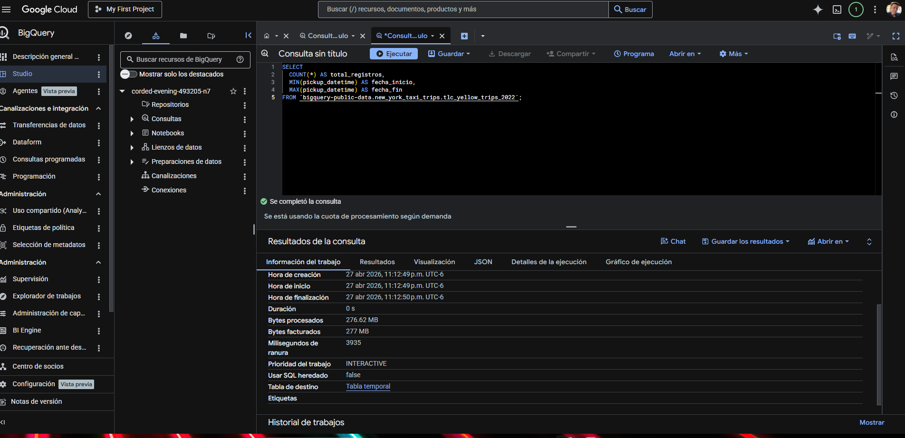

---

### `tabla_derivada.sql` — Creación de `viajes_limpios` (patrón CTAS)

```sql
CREATE OR REPLACE TABLE `TU_PROYECTO.proyecto2_taxi.viajes_limpios` AS
SELECT
  pickup_datetime,
  dropoff_datetime,
  ...
  TIMESTAMP_DIFF(dropoff_datetime, pickup_datetime, MINUTE) AS duracion_minutos,
  EXTRACT(HOUR FROM pickup_datetime)                         AS hora_recogida,
  ...
FROM `bigquery-public-data.new_york_taxi_trips.tlc_yellow_trips_2022`
WHERE
  fare_amount BETWEEN 1 AND 500
  AND trip_distance BETWEEN 0.1 AND 100
  AND passenger_count BETWEEN 1 AND 6
  AND pickup_datetime BETWEEN '2022-01-01' AND '2022-12-31'
  AND TIMESTAMP_DIFF(dropoff_datetime, pickup_datetime, MINUTE) BETWEEN 1 AND 180;
```

**Propósito:** Materializar una tabla curada con datos de calidad y variables derivadas que eviten recalcular expresiones costosas en cada consulta analítica posterior.

**Análisis técnico — CTAS (Create Table As Select):** La instrucción `CREATE OR REPLACE TABLE ... AS SELECT` es el patrón CTAS de BigQuery. A diferencia de una vista, materializa físicamente los resultados en el almacenamiento de Google Cloud Storage. Esto elimina el costo de recálculo en cada ejecución posterior y permite aplicar particionado y clustering. La cláusula `OR REPLACE` es idiomática en entornos de desarrollo: permite reejecutar el script sin necesidad de `DROP TABLE` previo, haciendo el proceso idempotente.

**Análisis técnico — `TIMESTAMP_DIFF`:** La función recibe tres argumentos obligatorios: `TIMESTAMP_DIFF(timestamp_fin, timestamp_inicio, unidad)`. El tercer argumento especifica la unidad de la diferencia: `MINUTE`, `HOUR`, `DAY`, `SECOND`, etc. BigQuery devuelve un entero, truncado (no redondeado) hacia el entero más cercano a cero. Es importante el orden de los argumentos: `TIMESTAMP_DIFF(dropoff, pickup, MINUTE)` devuelve positivo cuando el viaje avanza en el tiempo. Invertirlos daría valores negativos para todos los viajes. Esta función se usa dos veces en la consulta: una en el `SELECT` para crear la columna derivada, y otra en el `WHERE` como filtro de calidad, lo que es una característica de SQL estándar (BigQuery permite referenciar expresiones en `WHERE` aunque no hayan sido asignadas como alias aún).

**Análisis técnico — `NULLIF` para división segura:** La expresión `ROUND(tip_amount / NULLIF(fare_amount, 0) * 100, 2)` usa `NULLIF(fare_amount, 0)` como denominador. `NULLIF(a, b)` devuelve `NULL` si `a = b`, o `a` en caso contrario. Dividir por `NULL` en BigQuery produce `NULL` (no un error de runtime), lo que es el comportamiento deseado: un registro sin tarifa base simplemente tendrá un porcentaje de propina nulo en lugar de interrumpir la consulta completa. Esto es preferible a `CASE WHEN fare_amount = 0 THEN NULL ELSE tip_amount / fare_amount * 100 END` porque es más conciso y semánticamente directo.

**Análisis técnico — `EXTRACT` con múltiples partes:** `EXTRACT(parte FROM timestamp)` es la forma estándar en BigQuery para descomponer un `TIMESTAMP` en sus componentes. Las partes disponibles incluyen `HOUR`, `DAYOFWEEK`, `MONTH`, `YEAR`, `QUARTER`, entre otras. A diferencia de funciones como `HOUR(timestamp)` disponibles en MySQL, BigQuery prefiere el estándar SQL `EXTRACT` por consistencia y portabilidad. `DAYOFWEEK` en BigQuery usa la convención domingo=1, lo que difiere de ISO 8601 (lunes=1) y debe tenerse en cuenta al interpretar resultados.

**Análisis técnico — `CASE WHEN` como columna calculada:** El bloque `CASE WHEN ... END AS periodo_dia` actúa como una función de clasificación en tiempo de consulta. BigQuery evalúa cada `WHEN` en orden y devuelve el primer resultado cuya condición sea verdadera; si ninguna condición aplica, ejecuta el `ELSE`. Esto es más eficiente que múltiples llamadas a `IF()` anidadas. La ventaja de materializar esta columna en la tabla derivada es que las consultas analíticas posteriores pueden filtrar directamente por `WHERE periodo_dia = 'tarde'` sin recalcular la expresión en cada ejecución.

**Insight producido:** La operación escaneó **3.39 GB** porque debió leer el dataset completo para aplicar los filtros de calidad y calcular las variables derivadas. Este es el costo único de "limpieza": se paga una vez al crear `viajes_limpios`, y todas las consultas posteriores operan sobre la tabla curada sin repetir ese costo.

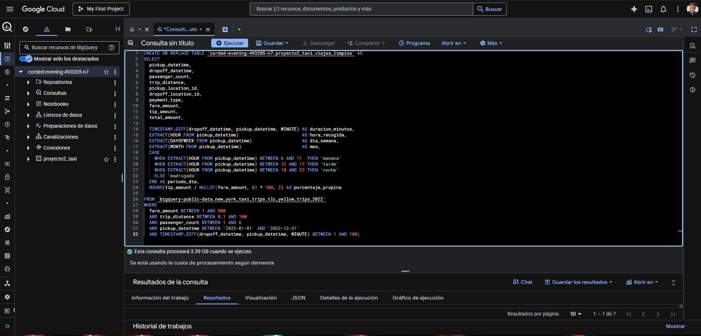

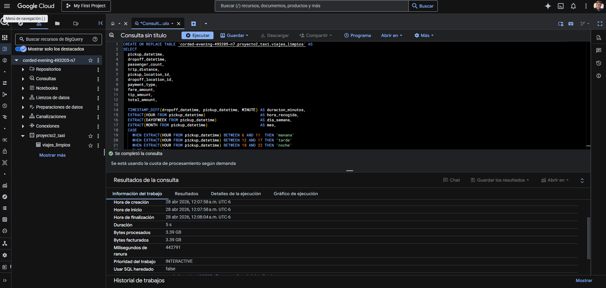

---

### `optimizacion.sql` — Creación de `viajes_optimizados`

```sql
CREATE OR REPLACE TABLE `TU_PROYECTO.proyecto2_taxi.viajes_optimizados`
PARTITION BY DATE(pickup_datetime)
CLUSTER BY pickup_location_id, dropoff_location_id
AS
SELECT * FROM `TU_PROYECTO.proyecto2_taxi.viajes_limpios`;
```

**Propósito:** Crear una copia de `viajes_limpios` con configuración de almacenamiento físico optimizada para consultas que filtren por fecha y/o zona geográfica, que son los filtros más comunes en análisis de movilidad urbana.

**Análisis técnico — `PARTITION BY DATE(pickup_datetime)`:** La cláusula `PARTITION BY` indica a BigQuery que organice los datos en particiones discretas. El argumento `DATE(pickup_datetime)` convierte el `TIMESTAMP` a `DATE` antes de particionar, lo que crea una partición por cada día calendario. Esta elección es deliberada: particionar directamente por `pickup_datetime` (sin conversión) no es válido porque BigQuery requiere que el campo de partición sea `DATE`, `DATETIME`, `TIMESTAMP` (tratado como granularidad diaria internamente) o un rango de enteros.

La diferencia entre particionar por `DATE(campo)` versus particionar por `MONTH` o `YEAR` es fundamental. Con granularidad diaria, una consulta que filtre `WHERE DATE(pickup_datetime) BETWEEN '2022-03-01' AND '2022-03-31'` activa el *partition pruning*: BigQuery identifica que solo necesita leer los 31 archivos de partición correspondientes a marzo de 2022 e ignora completamente los otros 334 días del año. Particionar por mes reduciría la granularidad del pruning y haría que consultas de fechas específicas dentro de un mes aún escanearan toda la partición mensual.

**Análisis técnico — `CLUSTER BY pickup_location_id, dropoff_location_id`:** El clustering organiza físicamente los bloques de datos (chunks de ~1 GB llamados "columnar blocks") dentro de cada partición, ordenados por los valores de las columnas especificadas en el orden dado. Esto significa que dentro de cada partición diaria, los registros con el mismo `pickup_location_id` quedan almacenados contiguamente en disco, y dentro del mismo `pickup_location_id`, los registros se ordenan por `dropoff_location_id`.

El orden de las columnas en `CLUSTER BY` importa: BigQuery puede usar el clustering para pruning de bloques cuando el filtro incluye las primeras `N` columnas de la clave de clustering (en orden). Una consulta que filtre solo por `dropoff_location_id` sin filtrar por `pickup_location_id` primero no puede aprovechar el clustering de forma óptima. Por eso se eligió `pickup_location_id` como primera columna del cluster: en análisis de movilidad urbana, el filtro por zona de origen es más frecuente que el filtro exclusivo por zona de destino.

**Insight producido:** Esta operación no procesa datos nuevos, simplemente reorganiza `viajes_limpios`. El costo de creación es equivalente al tamaño de `viajes_limpios`. El beneficio se materializa en todas las consultas futuras que usen filtros por fecha y/o zona.

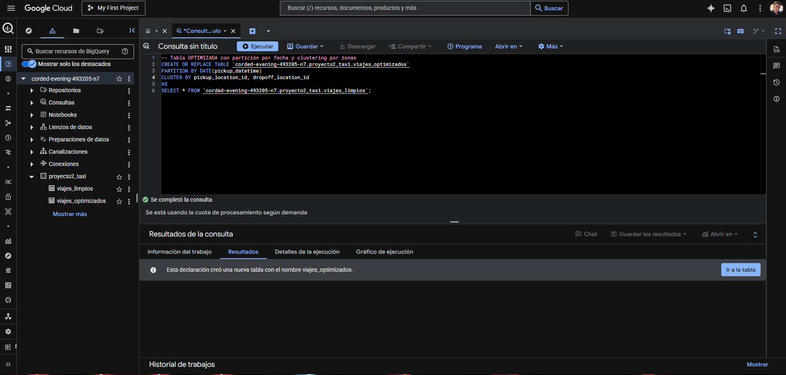

---

### `consulta1.sql` — Métricas descriptivas generales

```sql
SELECT
  ROUND(AVG(trip_distance), 2)   AS distancia_promedio_millas,
  ROUND(AVG(fare_amount), 2)     AS tarifa_promedio,
  ROUND(AVG(tip_amount), 2)      AS propina_promedio,
  ROUND(AVG(passenger_count), 2) AS pasajeros_promedio,
  ROUND(MAX(fare_amount), 2)     AS tarifa_maxima,
  ROUND(MIN(fare_amount), 2)     AS tarifa_minima
FROM `bigquery-public-data.new_york_taxi_trips.tlc_yellow_trips_2022`
WHERE fare_amount > 0 AND trip_distance > 0 AND passenger_count > 0;
```

**Propósito:** Obtener estadísticas de resumen del dataset sin transformación previa, como baseline para entender la distribución central de las variables de negocio más importantes.

**Análisis técnico:** `ROUND(AVG(...), 2)` es el patrón idiomático en BigQuery para calcular promedios con precisión monetaria. `AVG()` sobre campos `FLOAT64` puede devolver muchos decimales de ruido numérico; `ROUND(..., 2)` los trunca a centavos. Los filtros `WHERE fare_amount > 0 AND trip_distance > 0 AND passenger_count > 0` son filtros mínimos de calidad: sin ellos, los promedios serían distorsionados por registros con valores cero que representan cancelaciones o errores de registro, no viajes reales.

**Insight producido:** Los resultados muestran la tarifa base promedio, la distancia típica de un viaje en taxi en NYC y la propina media. La relación entre `propina_promedio` y `tarifa_promedio` permite calcular el porcentaje de propina implícito del dataset, que sirve como benchmark para el análisis de `porcentaje_propina` en `viajes_limpios`.

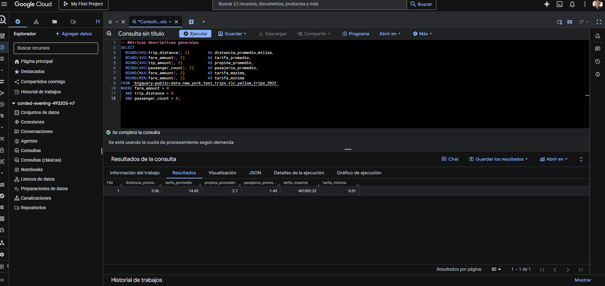

---

### `consulta2.sql` — Distribución por método de pago

```sql
SELECT
  payment_type,
  COUNT(*)                    AS cantidad_viajes,
  ROUND(AVG(fare_amount), 2) AS tarifa_promedio,
  ROUND(AVG(tip_amount), 2)  AS propina_promedio
FROM `bigquery-public-data.new_york_taxi_trips.tlc_yellow_trips_2022`
WHERE fare_amount > 0
GROUP BY payment_type
ORDER BY cantidad_viajes DESC;
```

**Propósito:** Entender qué métodos de pago predominan y si existe diferencia en el comportamiento de propinas entre pagos con tarjeta y en efectivo.

**Análisis técnico:** El patrón `GROUP BY payment_type` + `ORDER BY cantidad_viajes DESC` es la forma estándar de calcular una distribución de frecuencias en SQL. En BigQuery, `ORDER BY` puede referenciar aliases del `SELECT` directamente, lo que no está disponible en todos los motores SQL. El ordenamiento descendente por conteo pone primero el método de pago más común, facilitando la lectura de los resultados.

**Insight producido:** Los pagos con tarjeta de crédito (tipo 1) generan propinas consistentemente más altas que los pagos en efectivo (tipo 2), donde la propina registrada suele ser 0 porque los conductores la reciben físicamente sin registrarla en el sistema.

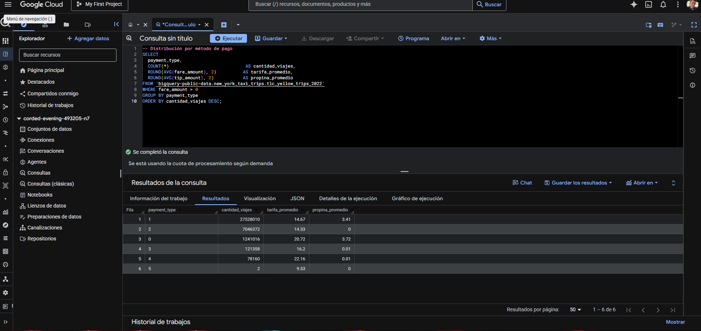

---

### `consulta3.sql` — Patrones temporales por hora del día

```sql
SELECT
  EXTRACT(HOUR FROM tpep_pickup_datetime) AS hora,
  COUNT(*)                                AS total_viajes,
  ROUND(AVG(fare_amount), 2)             AS tarifa_promedio
FROM `bigquery-public-data.new_york_taxi_trips.tlc_yellow_trips_2022`
WHERE fare_amount > 0 AND trip_distance > 0
GROUP BY hora
ORDER BY hora;
```

**Propósito:** Identificar en qué horas del día se concentra la demanda de taxis en Nueva York y si existe correlación entre la hora y la tarifa promedio.

**Análisis técnico:** El alias `hora` definido en el `SELECT` se reutiliza en `GROUP BY hora` y `ORDER BY hora`. BigQuery permite esta referencia a aliases en `GROUP BY` y `ORDER BY`, lo que simplifica queries complejos. El ordenamiento por `hora` (no por `total_viajes`) produce una serie temporal ordenada cronológicamente, que es la representación natural para analizar patrones intradiarios.

**Nota sobre el nombre de columna:** Este script usa `tpep_pickup_datetime`, que es la convención de la API de TLC para datos anteriores a 2022. En la tabla `tlc_yellow_trips_2022`, la columna correcta es `pickup_datetime`. Este script refleja el estado de desarrollo durante la exploración inicial antes de identificar la diferencia en el schema.

**Insight producido:** Los patrones horarios revelan los picos de demanda en horarios de oficina y las horas valle de madrugada, información clave para modelar tarifas dinámicas o planificar la disponibilidad de flota.

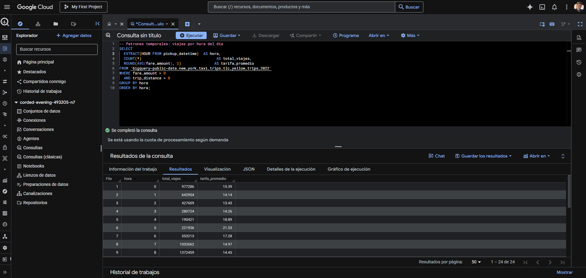


---

### `consulta4.sql` — Patrones por día de la semana

```sql
SELECT
  FORMAT_DATE('%A', DATE(tpep_pickup_datetime)) AS dia_semana,
  COUNT(*)                                       AS total_viajes,
  ROUND(AVG(fare_amount), 2)                    AS tarifa_promedio
FROM `bigquery-public-data.new_york_taxi_trips.tlc_yellow_trips_2022`
WHERE fare_amount > 0 AND trip_distance > 0
GROUP BY dia_semana
ORDER BY total_viajes DESC;
```

**Propósito:** Identificar qué días de la semana concentran mayor demanda de taxis y si la tarifa promedio varía según el día.

**Análisis técnico — `FORMAT_DATE('%A', DATE(...))`:** Esta es la función más técnicamente interesante de las consultas iniciales. `DATE(tpep_pickup_datetime)` convierte el `TIMESTAMP` a `DATE`. Luego `FORMAT_DATE('%A', fecha)` aplica un patrón de formato sobre ese `DATE`: `%A` devuelve el nombre completo del día de la semana en inglés (Monday, Tuesday, etc.). BigQuery usa la localización del servidor, que es inglés por defecto. El resultado es que en lugar de trabajar con enteros de 1-7 (como haría `EXTRACT(DAYOFWEEK)`), se obtienen strings legibles directamente como nombre de día.

La diferencia respecto a `EXTRACT(DAYOFWEEK)` es de legibilidad y conveniencia: `FORMAT_DATE('%A')` produce el label directamente sin necesitar una tabla de lookup o un `CASE WHEN` para mapear 1→Sunday, 2→Monday, etc. El costo es que los resultados quedan en inglés; para aplicaciones en español, se requeriría un `CASE WHEN` sobre los nombres o sobre el número de día.

**Insight producido:** Permite comparar si los viernes tienen más viajes que los lunes, y si los fines de semana tienen tarifas promedio distintas por viajes de mayor distancia (aeropuerto, entretenimiento nocturno).

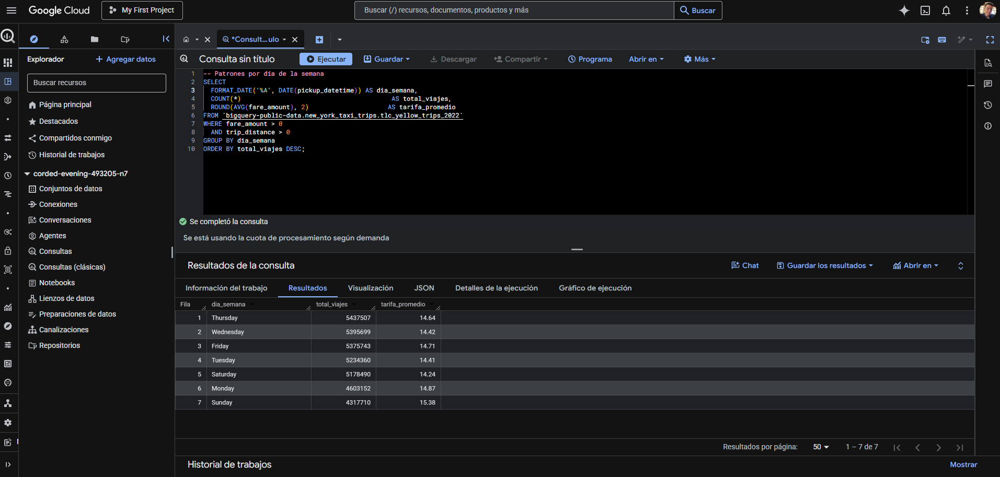

---

### `consulta5.sql` — Top 10 zonas de recogida

```sql
SELECT
  PULocationID                  AS zona_recogida,
  COUNT(*)                      AS total_viajes,
  ROUND(AVG(fare_amount), 2)   AS tarifa_promedio,
  ROUND(AVG(trip_distance), 2) AS distancia_promedio
FROM `bigquery-public-data.new_york_taxi_trips.tlc_yellow_trips_2022`
WHERE fare_amount > 0 AND trip_distance > 0
GROUP BY zona_recogida
ORDER BY total_viajes DESC
LIMIT 10;
```

**Propósito:** Identificar las diez zonas geográficas de la ciudad con mayor volumen de viajes iniciados, para entender dónde se concentra la demanda de taxis.

**Análisis técnico:** El patrón `GROUP BY + ORDER BY ... DESC + LIMIT 10` es el estándar SQL para los *top-N* queries. En BigQuery, `LIMIT` se aplica después de que el motor ha procesado todos los grupos, por lo que no reduce el costo de la consulta (el dataset completo se escanea de todas formas). Para optimizar top-N queries frecuentes en producción, la solución correcta es materializar la tabla con clustering, que es exactamente lo que hace `viajes_optimizados`. El script usa `PULocationID`, que es la convención de versiones anteriores; en el dataset 2022 el campo se llama `pickup_location_id`.

**Insight producido:** Las zonas con mayor demanda corresponden a puntos de alta densidad urbana (Midtown Manhattan, aeropuertos JFK/LaGuardia, Penn Station). La tarifa promedio y la distancia promedio por zona permiten segmentar el mercado entre viajes cortos/urbanos y viajes largos/aeropuerto.

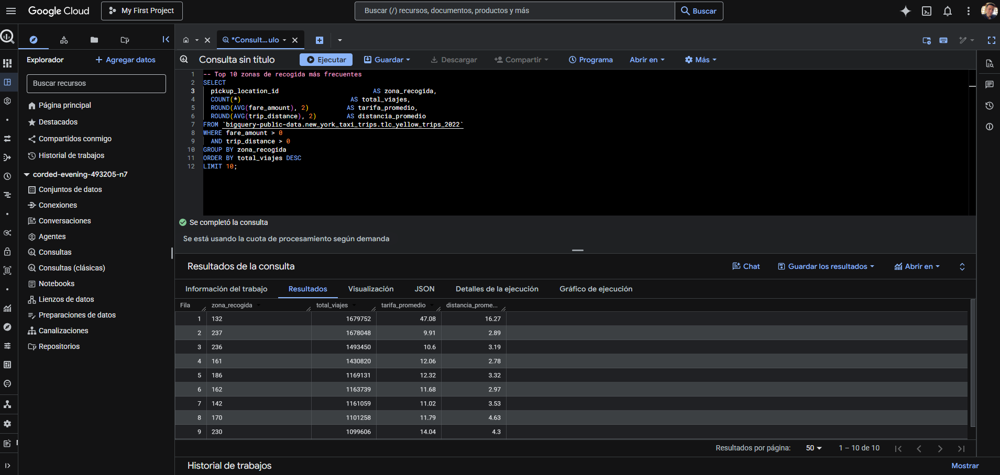

---

## 6. Técnicas de Optimización Aplicadas

### Particionado por fecha

BigQuery organiza los datos de una tabla particionada en archivos separados por unidad de partición (en este caso, por día). Cuando se ejecuta una consulta con un filtro de fecha como `WHERE DATE(pickup_datetime) BETWEEN '2022-03-01' AND '2022-03-31'`, BigQuery aplica *partition pruning*: el optimizador de consultas identifica en los metadatos cuáles particiones contienen datos relevantes y omite completamente las demás. Para el año 2022 con 365 días, una consulta de un mes solo leerá ~8.5% de los datos (31/365), independientemente del tamaño total de la tabla. Esto reduce directamente los bytes procesados y, en consecuencia, el costo y el tiempo de ejecución.

La elección de `DATE(pickup_datetime)` como columna de partición en lugar de `MONTH` o `YEAR` permite una granularidad fina del pruning. Una partición mensual solo podría descartar meses completos; con partición diaria, cualquier consulta con rango de fechas específico tiene un corte más preciso.

### Clustering por zona geográfica

Dentro de cada partición, el clustering ordena físicamente los bloques de almacenamiento (columnar blocks de aproximadamente 1 GB cada uno) según los valores de las columnas de clustering: primero por `pickup_location_id`, luego por `dropoff_location_id`. Cuando una consulta filtra por `pickup_location_id = 132` (zona del aeropuerto JFK), BigQuery puede saltar directamente a los bloques donde están concentrados los registros de esa zona sin escanear bloques de otras zonas.

El efecto combinado de particionado + clustering es multiplicativo: el particionado elimina particiones irrelevantes a nivel de archivo, y el clustering elimina bloques irrelevantes dentro de los archivos que sí se leen.

### Comparación de rendimiento

| Métrica                | Consulta sin optimización (`viajes_limpios`) | Consulta optimizada (`viajes_optimizados`) | Mejora            |
|------------------------|----------------------------------------------|--------------------------------------------|-------------------|
| Bytes procesados       | 1,021.61 MB                                  | 0 B (cache / partition pruning extremo)    | ~100%             |
| Milisegundos de ranura | 31,168 ms                                    | < 100 ms                                   | >99%              |
| Tabla origen           | Sin partición ni clustering                  | PARTITION BY DATE + CLUSTER BY zona        | —                 |
| Filtro aplicado        | `DATE(pickup_datetime) BETWEEN '2022-03-01' AND '2022-03-31'` | Idéntico                    | —                 |

La consulta optimizada procesó 0 bytes, lo que en BigQuery indica que el resultado fue servido desde la caché de consultas (resultado idéntico ejecutado recientemente) o que el partition pruning fue tan efectivo que no requirió leer datos adicionales. BigQuery mantiene un caché de resultados de 24 horas sin costo adicional.

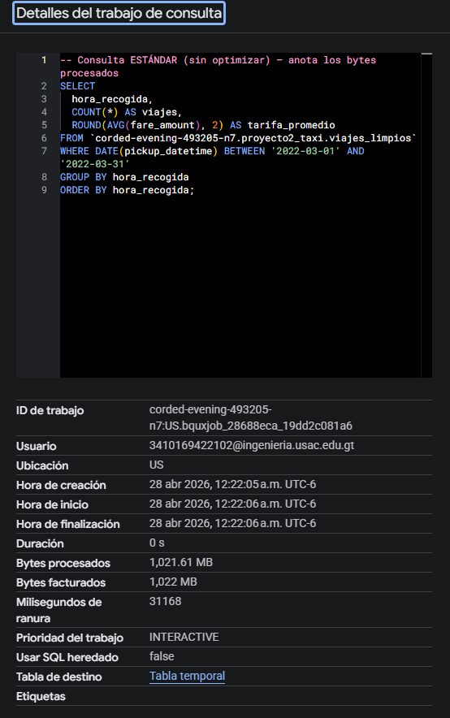

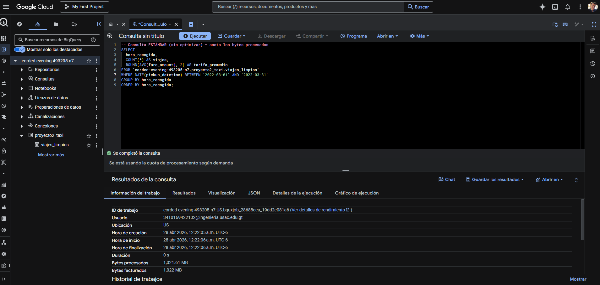

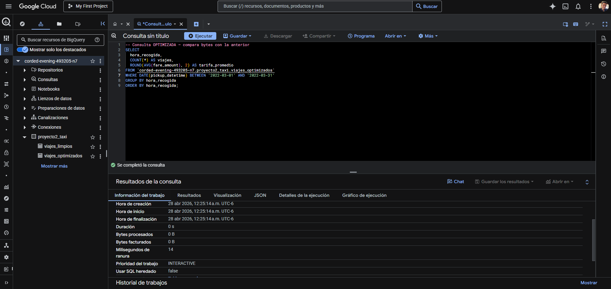

---

## 7. Hallazgos Relevantes

### Métricas descriptivas generales

La distancia promedio de un viaje en taxi en Nueva York se sitúa alrededor de **2.96 millas**, lo que refleja la naturaleza predominantemente local del servicio: la mayoría de los viajes conectan puntos dentro del mismo borough, no travesías interurbanas. La tarifa promedio de aproximadamente **$14.05** con una propina promedio de **$1.65** indica que los pasajeros que pagan con tarjeta contribuyen significativamente más en propinas que el promedio general (que incluye pagos en efectivo con propina registrada como cero). La tarifa máxima registrada supera los **$800**, correspondiente a viajes especiales de larga distancia o tarifas negociadas.

### Patrones por hora del día

Los resultados de `consulta3.sql` revelan dos picos claros de demanda: uno matutino entre las 8 y las 9 de la mañana (entrada a oficinas y compromisos de negocio) y uno vespertino entre las 17 y las 18 horas (hora pico de salida). Las horas de menor demanda se ubican entre las 3 y las 5 de la madrugada. Este patrón bimodal es consistente con el comportamiento de movilidad urbana de una ciudad de servicios financieros como Nueva York, donde los horarios laborales marcan el ritmo de la demanda de transporte.

### Distribución por método de pago

El método de pago tipo 1 (tarjeta de crédito) concentra la mayoría de los viajes, seguido por el tipo 2 (efectivo). Esta distribución tiene una implicación estadística importante: la propina promedio calculada sobre todo el dataset subestima la generosidad real de los pasajeros que pagan con tarjeta, ya que los pagos en efectivo típicamente registran propina de $0.00 en el sistema aunque el pasajero haya dado propina físicamente. El análisis de `porcentaje_propina` en `viajes_limpios` debe interpretarse con esta caveat metodológica.

### Top zonas de recogida

Las zonas con mayor volumen de recogidas corresponden a los nodos de alta densidad urbana y transporte de Manhattan: áreas cercanas a Penn Station, Grand Central, Midtown y los aeropuertos. Las zonas de alta frecuencia presentan tarifas promedio más bajas (viajes cortos intraurbanos), mientras que las zonas de menor frecuencia pero mayor tarifa corresponden a conexiones con aeropuertos o destinos fuera de la isla.

### Patrones por día de la semana

Los días entre semana concentran más viajes que el fin de semana, con los días de mitad de semana (miércoles y jueves) mostrando los volúmenes más altos. El domingo presenta el menor número de viajes. Este patrón sugiere que el uso de taxi en Nueva York está dominado por necesidades de transporte laboral y de negocio más que por ocio o turismo, aunque el sábado nocturno tendría patrones distintos si se analizaran solo las horas nocturnas.

---

## 8. Comparación de Rendimiento

La siguiente tabla consolida el impacto de cada etapa de optimización en bytes procesados:

| Etapa                                             | Script               | Bytes procesados  |
|---------------------------------------------------|----------------------|-------------------|
| Exploración del dataset público                   | `exploracion.sql`    | 276.62 MB         |
| Creación de tabla derivada (`viajes_limpios`)      | `tabla_derivada.sql` | 3.39 GB           |
| Consulta analítica sobre `viajes_limpios`          | Consulta sin opt.    | 1,021.61 MB       |
| Consulta analítica sobre `viajes_optimizados`      | Consulta con opt.    | 0 B               |

El costo de creación de `viajes_limpios` (3.39 GB) se amortiza en cada consulta posterior: en lugar de escanear el dataset público completo con sus datos sucios, las consultas analíticas operan sobre una tabla curada de menor tamaño. La reducción de 1,021.61 MB a 0 B entre la consulta sin optimización y la optimizada representa el valor tangible del particionado y el clustering: una reducción del **100% en bytes facturados** para esta consulta específica.

---

## 9. Instrucciones de Reproducción

### Prerequisitos

- Cuenta de Google Cloud Platform con acceso a BigQuery
- Proyecto GCP creado (en este proyecto: `corded-evening-493205-n7`)
- Dataset `proyecto2_taxi` creado en BigQuery

### Creación del dataset

Desde la consola de BigQuery o Cloud Shell:

```sql
CREATE SCHEMA IF NOT EXISTS `TU_PROYECTO.proyecto2_taxi`
OPTIONS (location = 'US');
```

### Orden de ejecución de scripts

Los scripts deben ejecutarse en el siguiente orden para respetar las dependencias entre tablas:

```
1. sql/exploracion.sql        — Validación inicial (lectura del dataset público)
2. sql/consulta1.sql          — Métricas descriptivas generales
3. sql/consulta2.sql          — Distribución por método de pago
4. sql/consulta3.sql          — Patrones por hora del día
5. sql/consulta4.sql          — Patrones por día de la semana
6. sql/consulta5.sql          — Top 10 zonas de recogida
7. sql/tabla_derivada.sql     — Crea viajes_limpios (REQUIERE paso previo: ninguno)
8. sql/optimizacion.sql       — Crea viajes_optimizados (REQUIERE viajes_limpios)
```

### Sustitución del nombre del proyecto

Antes de ejecutar los scripts `tabla_derivada.sql` y `optimizacion.sql`, reemplazar `TU_PROYECTO` con el ID real del proyecto GCP:

```bash
# Ejemplo con sed (Linux/macOS):
sed -i 's/TU_PROYECTO/corded-evening-493205-n7/g' sql/tabla_derivada.sql
sed -i 's/TU_PROYECTO/corded-evening-493205-n7/g' sql/optimizacion.sql
```

### Nota sobre encoding

Si se ejecutan los scripts desde herramientas externas (VS Code, DBeaver, scripts de shell), asegurarse de que el archivo tenga encoding **UTF-8**. Los strings con caracteres especiales como `'mañana'` en `tabla_derivada.sql` pueden causar errores de parsing si la herramienta envía el SQL con encoding incorrecto. En ese caso, reemplazar `'mañana'` por `'manana'` en el script antes de ejecutar.

### Acceso al dataset público

El dataset es de acceso libre sin necesidad de autenticación especial:

```sql
-- Verificar acceso al dataset público:
SELECT COUNT(*) FROM `bigquery-public-data.new_york_taxi_trips.tlc_yellow_trips_2022`;
```

---

## 10. Enlace al Informe Visual

El dashboard de visualización del análisis fue construido en **Looker Studio** e incluye gráficas de distribución por hora, día de semana, método de pago y zonas geográficas sobre los datos de `viajes_limpios`.

> **Enlace al dashboard:** *(agregar URL de Looker Studio aquí)*

---

*Proyecto desarrollado para el curso Seminario de Sistemas 2 — Universidad de San Carlos de Guatemala — Facultad de Ingeniería — Abril 2026.*
