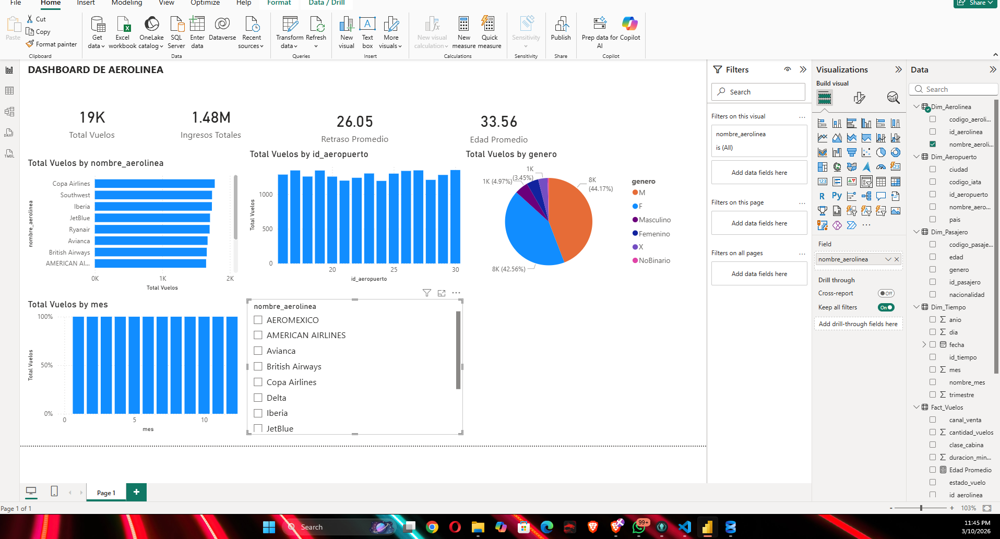
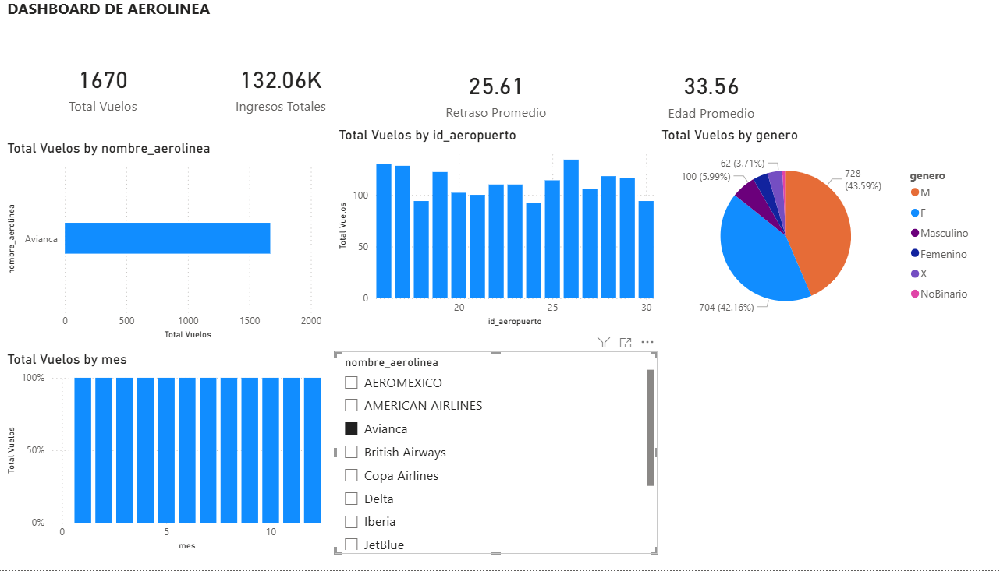
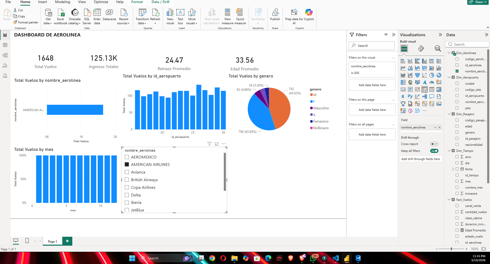

# Tarea 2.1 – Dashboard Analítico en Power BI  
**Seminario de Sistemas 2 | Ingeniería en Sistemas**  
**Universidad** | Ciclo 1, 2026

---

## Descripción General

Esta tarea es la continuación directa de la Práctica 1, en la cual se implementó un proceso ETL en Python para cargar un dataset de vuelos hacia una base de datos SQL Server bajo un modelo dimensional tipo estrella. En esta segunda etapa se utilizó **Power BI Desktop** para conectarse a dicha base de datos, cargar las tablas del modelo dimensional, aplicar transformaciones básicas en Power Query y construir un **dashboard analítico interactivo** que permite explorar los datos de vuelos desde múltiples perspectivas.

El objetivo principal es aplicar conceptos de **Business Intelligence (BI)** para transformar datos operacionales en información útil para la toma de decisiones.

---

## Descripción del Dataset

El dataset utilizado contiene información sobre vuelos comerciales e incluye las siguientes variables relevantes:

| Campo | Descripción |
|---|---|
| Aerolínea | Nombre de la aerolínea operadora del vuelo |
| Aeropuerto de origen | Código y nombre del aeropuerto de salida |
| Aeropuerto de destino | Código y nombre del aeropuerto de llegada |
| Pasajero | Información demográfica del pasajero (edad, género, etc.) |
| Fecha de vuelo | Año, mes y día del vuelo |
| Retraso (minutos) | Tiempo de retraso del vuelo en minutos |
| Precio del boleto (USD) | Costo del boleto en dólares estadounidenses |
| Total de maletas | Cantidad de maletas registradas por vuelo |
| Clase de cabina | Categoría del asiento (económica, ejecutiva, primera clase) |

El dataset fue previamente limpiado y cargado a SQL Server durante la **Práctica 1** mediante un script ETL en Python.

---

## Arquitectura del Sistema

El sistema sigue una arquitectura clásica de **Business Intelligence** compuesta por tres capas:

```
┌─────────────────────────────────────────────────────────────────┐
│                        FUENTE DE DATOS                          │
│              dataset_vuelos_crudo.csv  (archivo plano)          │
└───────────────────────────┬─────────────────────────────────────┘
                            │
                            ▼
┌─────────────────────────────────────────────────────────────────┐
│                       PROCESO ETL (Python)                      │
│   Extracción → Transformación → Carga (pandas + pyodbc)         │
└───────────────────────────┬─────────────────────────────────────┘
                            │
                            ▼
┌─────────────────────────────────────────────────────────────────┐
│              DATA WAREHOUSE  –  SQL Server                      │
│         Instancia: localhost\SQLEXPRESS                         │
│         Base de datos: Vuelos_Practica1                         │
│         Modelo dimensional tipo estrella                        │
└───────────────────────────┬─────────────────────────────────────┘
                            │
                            ▼
┌─────────────────────────────────────────────────────────────────┐
│                    CAPA DE PRESENTACIÓN                         │
│              Power BI Desktop – Dashboard Analítico             │
│           Medidas DAX · Visualizaciones · Segmentadores         │
└─────────────────────────────────────────────────────────────────┘
```

---

## Modelo de Datos

El modelo dimensional implementado sigue el esquema **estrella (Star Schema)**, con una tabla de hechos central y cuatro dimensiones relacionadas.

### Diagrama del Modelo

```
         Dim_Tiempo                Dim_Aerolinea
        ┌──────────┐              ┌─────────────┐
        │id_tiempo │              │id_aerolinea │
        │año       │              │nombre       │
        │mes       │              │pais         │
        │dia       │              └──────┬──────┘
        │trimestre │                     │
        └─────┬────┘                     │
              │                          │
              ▼                          ▼
         ┌────────────────────────────────────────┐
         │              Fact_Vuelos               │
         │  id_vuelo (PK)                         │
         │  id_aerolinea  ──────────────────────► Dim_Aerolinea
         │  id_pasajero   ──────────────────────► Dim_Pasajero
         │  id_tiempo     ──────────────────────► Dim_Tiempo
         │  id_origen     ──────────────────────► Dim_Aeropuerto
         │  id_destino    ──────────────────────► Dim_Aeropuerto
         │  cantidad_vuelos                       │
         │  precio_boleto_usd                     │
         │  retraso_minutos                       │
         │  total_maletas                         │
         └────────────────────────────────────────┘
              ▲                          ▲
              │                          │
        ┌─────┴──────┐          ┌────────┴───────┐
        │Dim_Pasajero│          │ Dim_Aeropuerto  │
        │id_pasajero │          │ id_aeropuerto   │
        │nombre      │          │ nombre          │
        │edad        │          │ ciudad          │
        │genero      │          │ pais            │
        │nacionalidad│          └────────────────┘
        └────────────┘
```

### Relaciones del Modelo

| Tabla Dimensión | Campo Clave | Tabla de Hechos | Campo Relacionado |
|---|---|---|---|
| `Dim_Aerolinea` | `id_aerolinea` | `Fact_Vuelos` | `id_aerolinea` |
| `Dim_Pasajero` | `id_pasajero` | `Fact_Vuelos` | `id_pasajero` |
| `Dim_Tiempo` | `id_tiempo` | `Fact_Vuelos` | `id_tiempo` |
| `Dim_Aeropuerto` | `id_aeropuerto` | `Fact_Vuelos` | `id_origen` |
| `Dim_Aeropuerto` | `id_aeropuerto` | `Fact_Vuelos` | `id_destino` |

> **Nota:** `Dim_Aeropuerto` participa dos veces en la tabla de hechos mediante una relación activa (`id_origen`) y una relación inactiva (`id_destino`).

---

## Transformaciones Realizadas en Power Query

Al importar las tablas a Power BI se realizaron las siguientes transformaciones dentro del Editor de Power Query:

1. **Validación de tipos de datos:** Se verificó que cada columna tuviera el tipo de dato correcto (entero, decimal, texto, fecha), corrigiendo casos donde SQL Server transmite tipos genéricos.

2. **Limpieza de valores nulos:** Se identificaron y eliminaron filas con valores nulos en columnas clave como `id_vuelo`, `id_aerolinea` e `id_pasajero`, para garantizar la integridad referencial del modelo.

3. **Verificación de relaciones:** Se confirmó que los valores de las claves foráneas en `Fact_Vuelos` tuvieran correspondencia en cada tabla de dimensión, evitando registros huérfanos que pudieran afectar las medidas DAX.

4. **Preparación del modelo para análisis:** Se renombraron columnas donde fue necesario para mayor claridad, y se ocultaron campos técnicos no relevantes para el usuario final del dashboard.

---

## Medidas DAX Implementadas

Las siguientes medidas fueron creadas en Power BI usando el lenguaje **DAX (Data Analysis Expressions)**:

```dax
Total Vuelos = SUM(Fact_Vuelos[cantidad_vuelos])
```
> Suma el total de vuelos registrados en el dataset.

```dax
Ingresos Totales = SUM(Fact_Vuelos[precio_boleto_usd])
```
> Suma el total de ingresos generados por la venta de boletos en USD.

```dax
Retraso Promedio = AVERAGE(Fact_Vuelos[retraso_minutos])
```
> Calcula el promedio de minutos de retraso por vuelo.

```dax
Edad Promedio = AVERAGE(Dim_Pasajero[edad])
```
> Calcula la edad promedio de los pasajeros registrados.

```dax
Total Maletas = SUM(Fact_Vuelos[total_maletas])
```
> Suma el total de maletas facturadas en todos los vuelos.

Todas las medidas están diseñadas para responder dinámicamente a los filtros aplicados por los segmentadores del dashboard.

---

## Dashboard de Power BI

### Componentes del Dashboard

El dashboard se estructuró en una sola página con los siguientes elementos visuales:

#### Tarjetas KPI
Ubicadas en la parte superior del dashboard, muestran los indicadores principales de un vistazo:

| KPI | Medida DAX utilizada |
|---|---|
| Total de Vuelos | `Total Vuelos` |
| Ingresos Totales (USD) | `Ingresos Totales` |
| Retraso Promedio (min) | `Retraso Promedio` |
| Edad Promedio de Pasajeros | `Edad Promedio` |

#### Visualizaciones Principales

| Gráfico | Tipo | Descripción |
|---|---|---|
| Vuelos por Aerolínea | Barras horizontales | Compara el volumen de vuelos operados por cada aerolínea |
| Distribución por Género | Dona | Muestra la proporción de pasajeros masculinos y femeninos |
| Vuelos por Mes | Columnas verticales | Analiza la estacionalidad del tráfico aéreo a lo largo del año |

#### Segmentadores (Slicers)

Los siguientes filtros interactivos permiten explorar los datos por subconjuntos específicos:

- **Aerolínea:** Filtra todas las visualizaciones por una o varias aerolíneas.
- **Género:** Filtra los datos por el género del pasajero (Masculino / Femenino).
- **Clase de cabina:** Filtra según la categoría del asiento (Económica, Ejecutiva, Primera Clase).

---

## Interpretación de los Principales KPIs

- **Total de Vuelos:** Permite conocer el volumen general de operaciones en el periodo analizado. Un valor alto indica alta actividad aérea; filtrando por aerolínea se puede identificar cuál domina el mercado.

- **Ingresos Totales:** Refleja la facturación acumulada del periodo. Es sensible al filtro de clase de cabina, ya que la primera clase genera ingresos significativamente mayores por boleto.

- **Retraso Promedio:** Un indicador de eficiencia operacional. Si supera los 30 minutos en promedio, sugiere problemas en la puntualidad de ciertas aerolíneas o rutas. Comparar este KPI entre aerolíneas revela diferencias de desempeño.

- **Edad Promedio:** Permite entender el perfil demográfico del pasajero típico. Combinado con el filtro de clase de cabina, puede revelar que los pasajeros de primera clase tienden a ser de mayor edad.

---

## Capturas del Dashboard

### Vista General del Dashboard



---

### Dashboard con Filtros Aplicados



---




---

## Conclusiones

1. **Integración exitosa del modelo dimensional con Power BI:** La carga de las tablas desde SQL Server a Power BI se completó sin inconvenientes, y las relaciones del esquema estrella se reconocieron correctamente dentro del modelo de datos de Power BI.

2. **El modelo estrella facilita el análisis multidimensional:** La separación entre la tabla de hechos y las dimensiones permite crear medidas DAX limpias y aplicar filtros cruzados de forma eficiente entre todas las visualizaciones del dashboard.

3. **Los segmentadores potencian la exploración de datos:** La inclusión de filtros por aerolínea, género y clase de cabina convierte el dashboard en una herramienta interactiva que permite responder preguntas de negocio sin modificar el modelo subyacente.

4. **Los KPIs revelan patrones relevantes:** El análisis del retraso promedio por aerolínea y la distribución de ingresos por clase de cabina son los indicadores de mayor valor analítico para identificar áreas de mejora operacional y oportunidades comerciales.

5. **Power BI como herramienta de BI:** La experiencia confirma que Power BI es una plataforma accesible y poderosa para la creación de dashboards analíticos sobre modelos dimensionales, integrándose de manera fluida con SQL Server como fuente de datos estructurada.

---

## Tecnologías Utilizadas

| Herramienta | Versión / Detalle | Uso |
|---|---|---|
| Python | 3.x | Proceso ETL (Práctica anterior) |
| pandas | Última estable | Transformación de datos |
| pyodbc | Última estable | Conexión a SQL Server |
| SQL Server Express | localhost\SQLEXPRESS | Data Warehouse |
| Base de datos | `Vuelos_Practica1` | Almacenamiento del modelo dimensional |
| Power BI Desktop | Más reciente | Análisis y visualización |
| DAX | Lenguaje nativo Power BI | Medidas y cálculos del dashboard |

